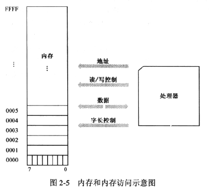
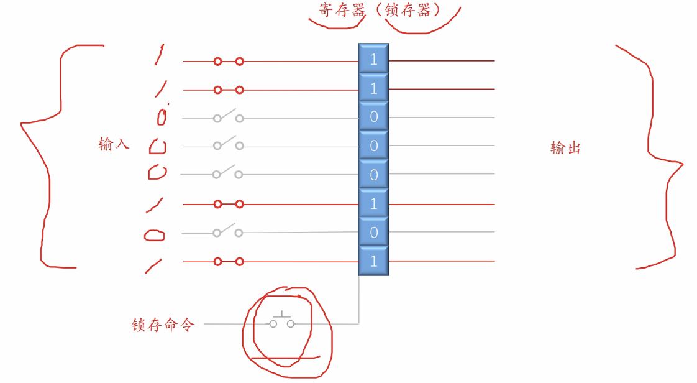
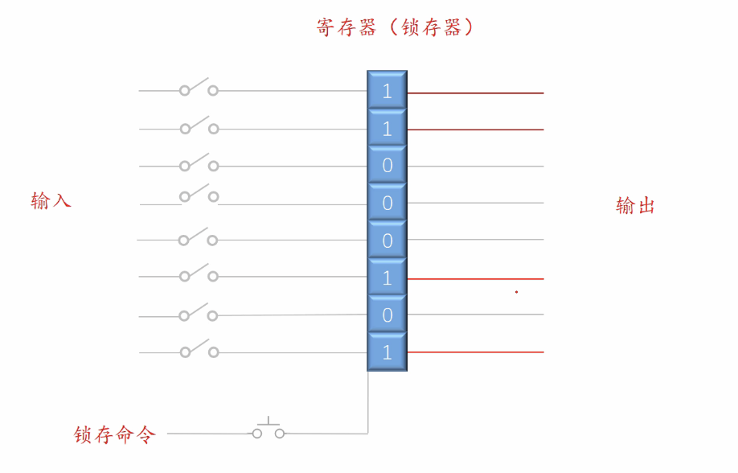
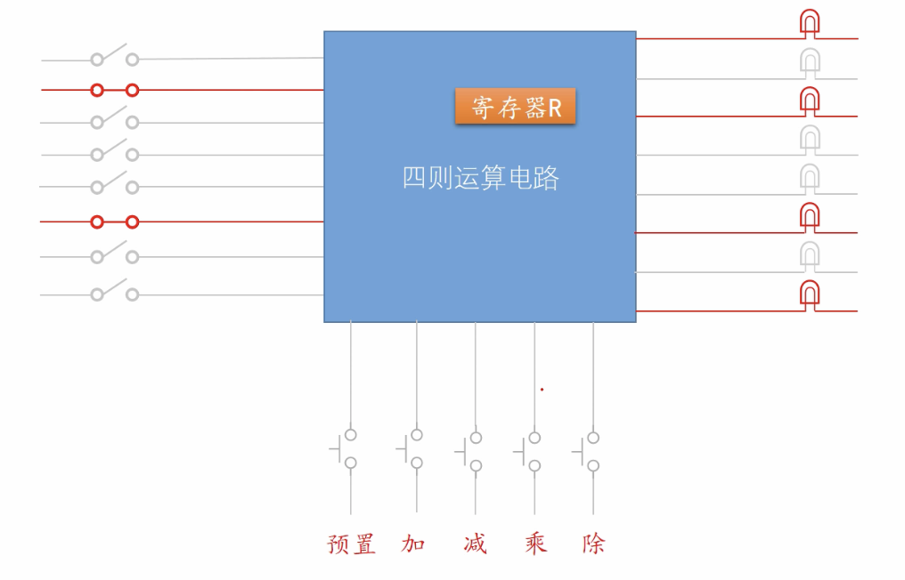
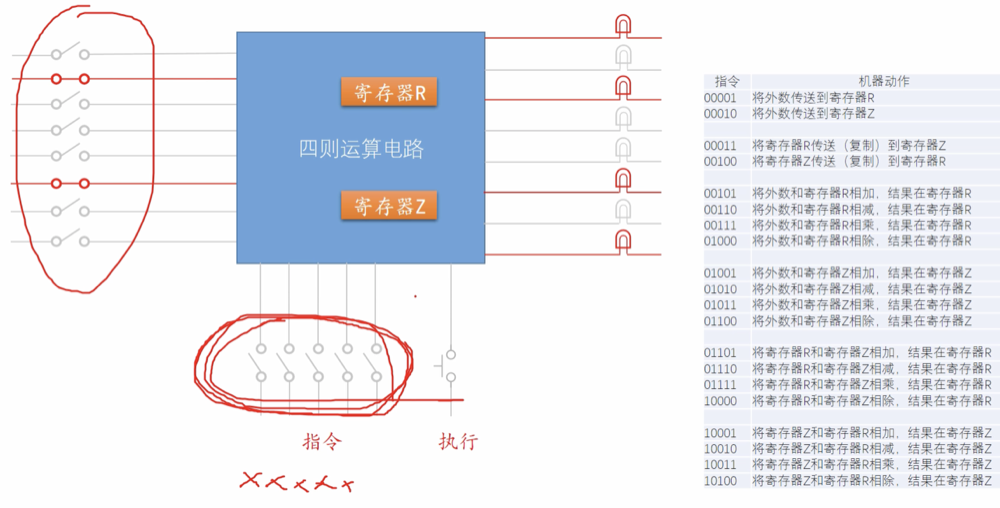
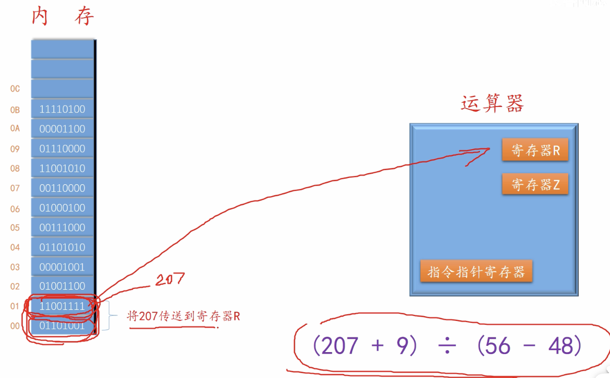
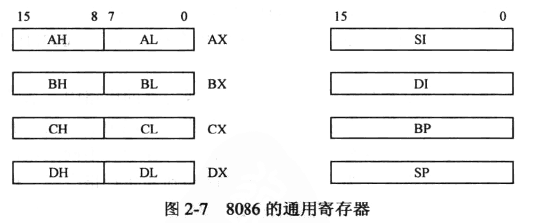

[TOC]


## 一、基础知识

#### 其他小知识

**<u>32 位（bit） = 4 字节 = 2 字 = 1 双字</u>**


内存条：单次访问最小单位为 1 字节。




## 二、寄存器、指令

#### 寄存器锁存

**寄存器锁存命令使用前：**
    输入任何内容不会影响寄存器。


**寄存器锁存命令使用后：**
    当前输入内容被存储用于输出，后续输入不影响寄存器值。


#### 使用寄存器完成四则运算



**预置命令：**使输入的值存储在寄存器中

**加、减...命令：**输入的值与寄存器的值进行操作

#### 机器指令

​		上述寄存器操作只能完成一些简单四则运算，当我们遇到一个有优先级的四则运算时，其中的一些计算值需要存储，这样我们就需要更多的寄存器。

​		但当寄存器的中间值都算完毕需要最终运算时，就需要多个寄存器之间进行运算。于是就有了寄存器**<u>指令</u>**：

​		在运算电路中，有**<u>5个引脚</u>**专门用来对应各个操作类型的动作（如下图）。**<u>指令</u>**就是给这个电路下达了操作命令，当执行按下时就会执行指令对应的操作。



#### 内存

内存与运算器：

如图：01101001 为指令，意为讲数字存到寄存器 R 中，值为207.

	运算器根据内存提供的指令一直工作，0b:11110100为终止指令。


## 三、8086 处理器简介

​		8086 有 8 个 16 位通用寄存器，分别命名为：AX、BX、CX、DX、SI、DI、BP、SP。其中前四个可以拆分成两个 8 位寄存器来使用。



### 处理器内部组成：


​		**<u>ALU（算术逻辑部件）</u>**，计算后会将结果先存储到**<u>数据暂存器</u>**，**<u>控制器</u>**处理调度，6字节的**<u>指令预取队列</u>**排队。

​		8086 内部有 4 个**<u>段寄存器</u>**。**<u>CS 是代码段寄存器</u>**，**<u>DS 是数据段寄存区</u>**，**<u>SS 是栈段寄存器</u>**，**<u>ES 是附加段寄存器</u>**：附加段的意思是，它是额外赠送的礼物，当需要在程序中同时使用两个数据段时，DS指向一个，ES指向另一个。

​		**<u>IP 是指令指针计算器</u>**，它只和 CS 一起使用，而且只有处理器才能改变它的内容。当一段代码开始执行时，CS 指向代码段的起始地址，IP 则指向段内偏移。


## 汇编语言

​		为了方便人们编写与阅读，发明了汇编语言。将上述的四则运算翻译成汇编语言后：

```assembly
mov r,207 #把207移动到r
add r,9   #把r的值+9然后放到r中

mov z,56
sub z,48  #把z的值-48然后放到z中

div r,z   #r /= z

mov [12],r  #把r的值放到 12 这个内存地中

hlt    #停止
```


