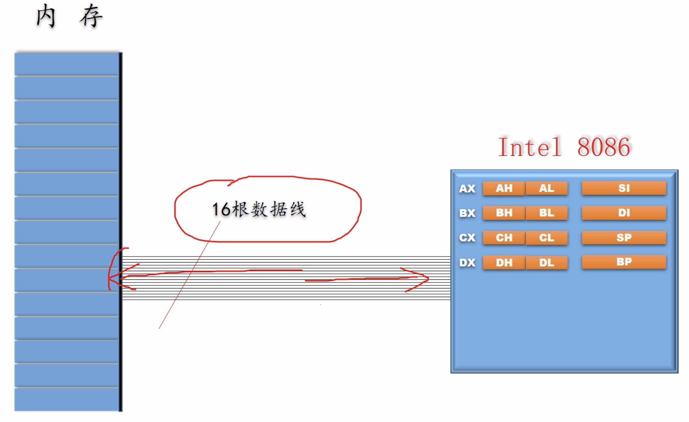

[TOC]

## 8086处理器寄存器

​		在 8086 处理器的寄存器中，**<u>有 8 个 16 位通用寄存器：AX,BX,CX,DX,SI,DI,BP,SP</u>**，其中，AX,BX,CX,DX这 4 个 16 位寄存器又可分别拆分位高 8 位寄存器和低 8 位寄存器。

例如AX寄存器：

## 8086访问内存

​		在8086处理器中，有 16 根内存数据线（正好跟寄存器长度对应），其中数据线是可双向传递数据的。

​		内存是可以根据系统的设置字节序的，所以当寄存器想把数据存入内存时，如果是低字节序，寄存器会先存低8位，再存高8位；高字节序则相反。

##### 程序在内存的布局

##### 

​		在上图中，程序在内存中分为了两部分：**程序段**（图中黄色从 0x0000 开始）、**数据段**（图中蓝色从 0x0c00 开始）。

​		在程序段中，存放着各种面向寄存器的操作指令，比如：

​		<u>在 0x0000 处，其中 A1 为指令操作：将内存地址中的一个字传送到 AX 寄存器；后面的紧跟着的就是上面的内存地址：0c，00 ，即为 0x0c00 ( 8086 是低字节序)</u> 

