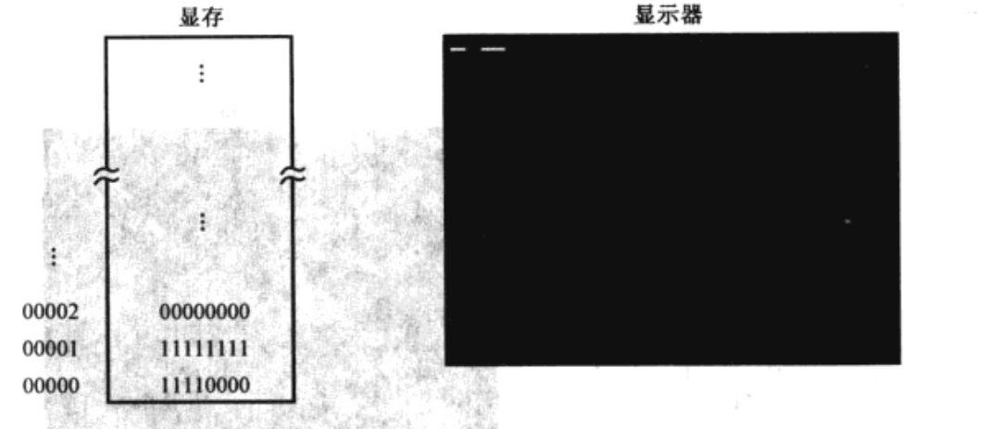
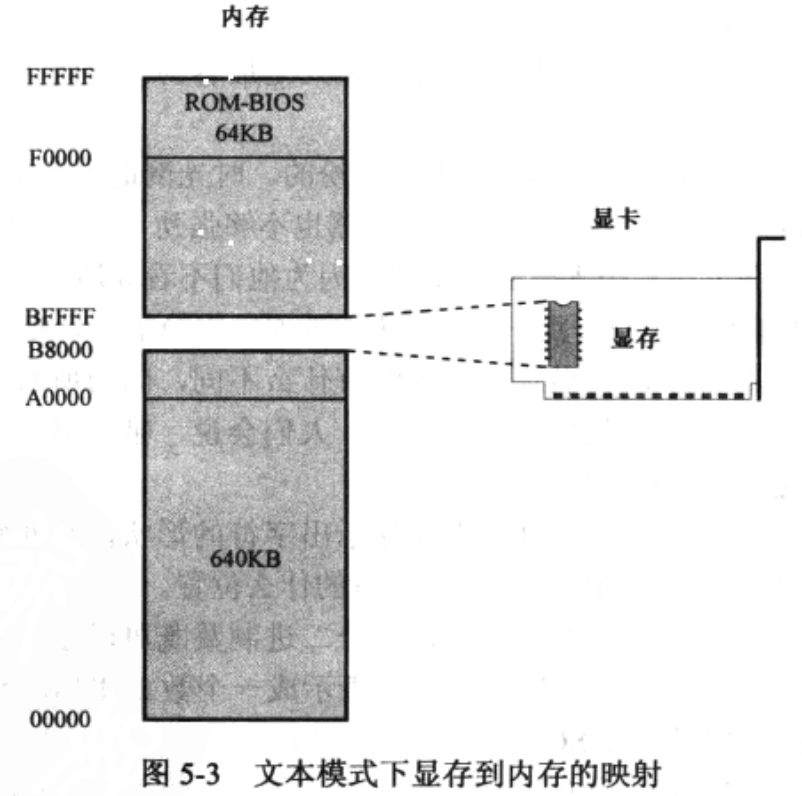

[TOC]

## 一、启动

​		当一个操作系统启动的时候，首先访问的硬盘的**<u>主引导扇区</u>**，也就是<u>0面0道1扇区</u>。ROM-BIOS程序将主引导扇区的数据加载到逻辑地址：

​		`0x0000：0x7c00`

表示 0x0000 的代码段中的 0x7c00 处，也就是物理地址的 0x7c00处，然后判断它是否有效。

​		一个有效的主引导扇区的最后两字节应当是 0x55 和 0xAA。BIOS 程序检测这两个标志后，会触发 `jmp 0x0000：0x7c00`跳到哪里继续执行。

​		我们将在此章节写出一个主引导扇区程序。

## 二、显示

### 1、显卡和显存

​		本程序想要在屏幕上显示一行文字。为了显示，需要用到显卡和显示器。

​		显卡控制着显示器的每一个像素，显卡会将显示器将要显示的数据用**<u>显卡存储器</u>**存起来，然后显示器依次输出每一帧。		

​		如下图所示，显存的第一个字节对应着屏幕左上角连续的8个像素；第2个字节对应着屏幕上后续的8个像素，后面以此类推。



​		显示一个像素容易，但是要操作显存里面的比特，使屏幕上能显示出字符地形状，是非常麻烦、繁重的工作。但是，就像二进制即可以是一个普通的数，也可以代表一条处理器指令一样，<u>每个字符也可以表示成一个数</u>。比如，数字 0x4c 就代表字符 “L”，这个数被称为字符 “ L ”的 ASCII 码。

​		 显卡有两种基本工作模式：文本模式和图形模式。在不同模式下，显卡对显存的内容解释是不一样的。比如文本模式下，会把显存的每条解释成字符。

​		为了能显示，我们首先得访问显存，为此，计算机系统的设计者们<u>直接把显存映射到了内存中</u>。

​		**<u>比如在 8086 中，系统可以访问 1M 内存，其中 0x00000~9FFFF 属于常规内存，由内存条提供；0xF0000~0xFFFFF 由主板上的一个芯片提供，即 ROM-BIOS。这样一来，中间还有一个 320KB 的空洞，即 0xA0000~0xEFFFF。传统上，这段地址空间由特定的外围设备来提供，其中就有显卡。</u>**

​		如下图：0xB8000~0xBFFFF 这端物理空间就是留给显卡的。




### 2、初始化段寄存器

​		访问显存也是需要逻辑地址，也就是“段地址：偏移地址”的形式，这是处理器的要求。对于显存，则可以看成段地址为  0xB800 ，偏移地址从 0x0000 延伸到 0xFFF 的区域。

​		我们可以写出下面的代码：

```assembly
mov ax,0xb800
mov es,ax
```

有的人会问为啥不直接 `mov ex,0xb800`?  因为 Intel 的处理器不允许将一个立即数传送到段寄存器，它只允许这样的指令：

```assembly
mov 段寄存器,通用寄存器
mov 段寄存器,内存单元
```

### 3、显存的访问和 ASCII 码

​		当我们把 0xb800 放到 es 寄存器后，就可以对内写入内容了：

```assembly
mov byte [es:0x00],'L'
mov byte [es:0x01],0x70
```

​		上述两个字节一个显示字符，一个表示颜色。0x70 可以解释为黑底白字，无闪烁，无加亮。


