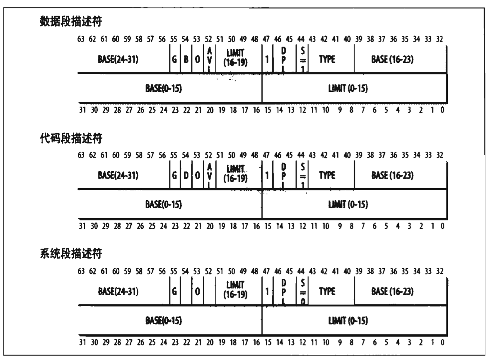
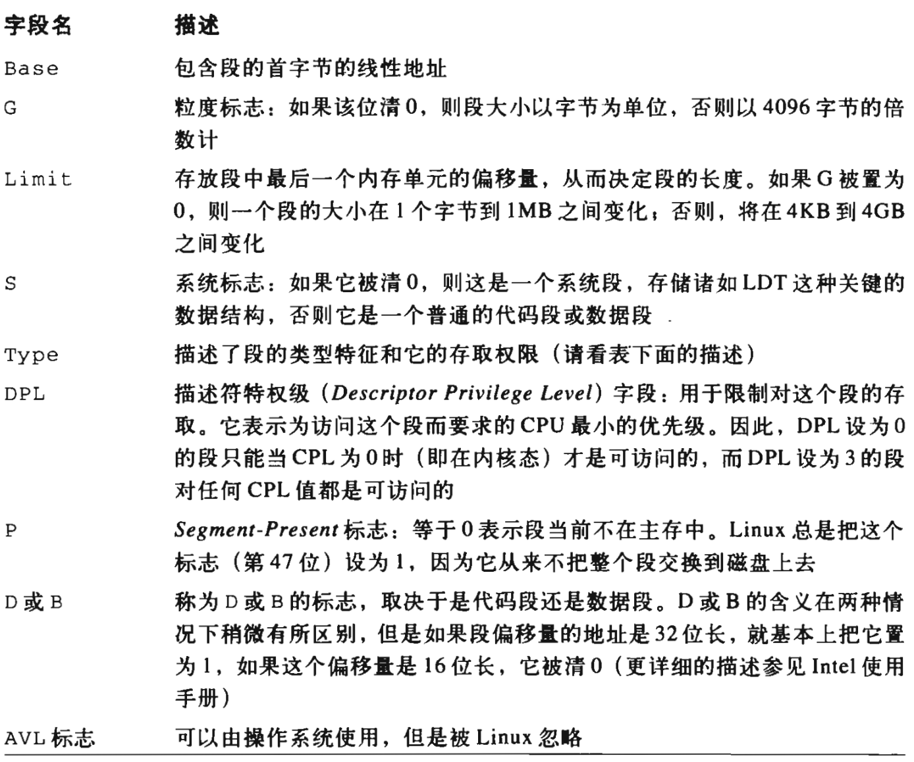
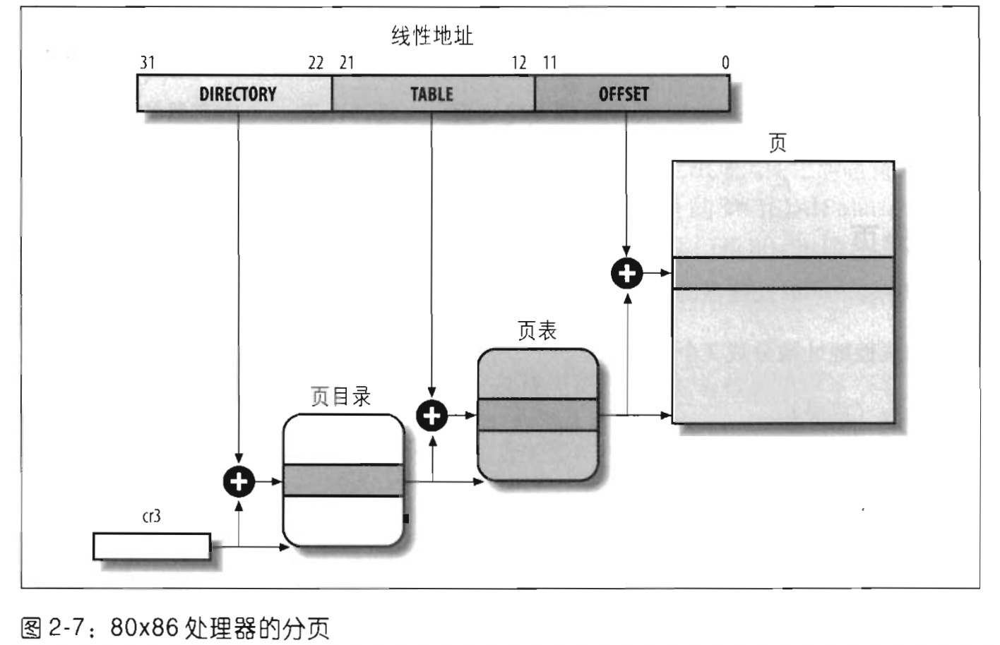

[TOC]

## 一、内存地址

​		内存地址分为三种：

- **逻辑地址**。每一个逻辑地址由一个**段（segment）**和**偏移量（offset）**组成。
- **线性地址（也称虚拟地址）**。线性地址通常用十六进制数字表示，值的范围从 0x00000000 到 0xffffffff 也就是 4 GB。
- **物理地址**。就是内存芯片级内存单元寻址。

**<u>内存控制单元（MMU）</u>**通过一种称为**<u>分段单元</u>**的硬件把一个逻辑地址转为线性地址；接着，第二个称为**<u>分页单元</u>**的硬件把线性地址转换成一个物理地址。

## 二、硬件中的分段

### 段选择符和段寄存器

​		<u>一个逻辑地址由两部分组成：一个段标识符和一个段内相对地址偏移量</u>。段标识符是一个 16 位长的字段，称为段选择符，而偏移量是一个 32 位长的字段。

​		为了快速方便的找到段选择符，处理器提供了段寄存器，<u>段寄存器的唯一目的是存放段选择符</u>。这些段寄存器称为 cs，ss，ds，es，fs 和 gs。

6个寄存器中3个有专门的用途：

- cs   代码段寄存器，指向包含程序指令的段。
- ss	栈段寄存器，指向包含当前程序栈的段。
- ds	数据段寄存器，指向包含静态数据或者全局数据段。

cs 还有一个重要的功能: 它还有一个两位的字段，表明 CPU 当前的特权级，0表示内核态，3表示用户态。

### 段描述符

​		每个段由一个8位的段描述符表示，他描述了段的特征。段描述符一般放在全局描述表(GDT) 或者局部描述表(LDT)。

下图解释了段描述符格式：

下图解释了各个字段的含义：

## 三、硬件中的分页

​		分页单元把线性地址转换为物理地址。其中一个关键任务就是把请求的访问类型与线性地址的访问权限相比较，如果这次内存访问是无效的，就会产生一个缺页异常。

​		为了效率，**<u>线性地址被分成以固定长度为单位的组，称为页(page)</u>**。<u>页内部连续的线性地址被映射到连续的物理地址中。</u>

​		分页单元把所有的 RAM 分成固定的**页框**（page frame，有时也叫物理页），每一个页框包含一个页，也就是说一个页框的长度与一个页的长度一致。页框是主存的一部分，而页只是一个数据块，可存放在页框或磁盘中。

​		**<u>把线性地址映射到物理地址的数据结构称为页表(page table)</u>**，页表放在主存中，在启用分页单元之前由内核初始化。

### 常规分页

​		Intel 处理器的分页单元处理 4KB 的页。32 位的线性地址分成 3 个域：

- **Directory（目录）**，最高 10 位；
- **Table（页表）**，中间 10 位；
- **Offset（偏移量）**，最低 12 位。

​		线性地址的转换分两步完成，每一步都基于一种转换表，第一种转换表称为页目录表（page directory），第二种转换表称为页表（page table）。

​		每个活动进程必须有一个分配给它的页目录。但是只在进程实际需要一个页表的时候才给该页表分配 RAM。

​		正在用的页目录物理地址在控制寄存器 cr3 中。
线性地址内的 directory 字段决定页目录中的目录项，而目录项指向适当的页表；
地址的 Table 字段依次又决定页表中的表项，而表项含有页所在页框的物理地址；
Offset 字段决定页框内的相对位置，由于它是 12 位长，故每一页含有 4096 字节数据。Directory 字段和 Table 字段都是 10 位长，因此页目录和页表都可以多达 1024 项，故一个页目录可以寻址 1024x1024x4096 = 2^32 个存储单元。

- **Present 标志**，如果被置为 1，所指的页在主存中，如果为 0 ，则这一页不在主存中。

### 扩展分页

​		8086引入了**<u>扩展分页</u>**，它允许页框大小为 4 MB 而不是 4 KB 。扩展分页用于把大段连续的线性地址转换成相应的物理地址，这样内核就可以不用中间页表进行地址转换，从而节省内存。

​		启用后，分页单元把32位线性地址分为两个字段：

- directory  高10位
- offset  剩下 22 位

