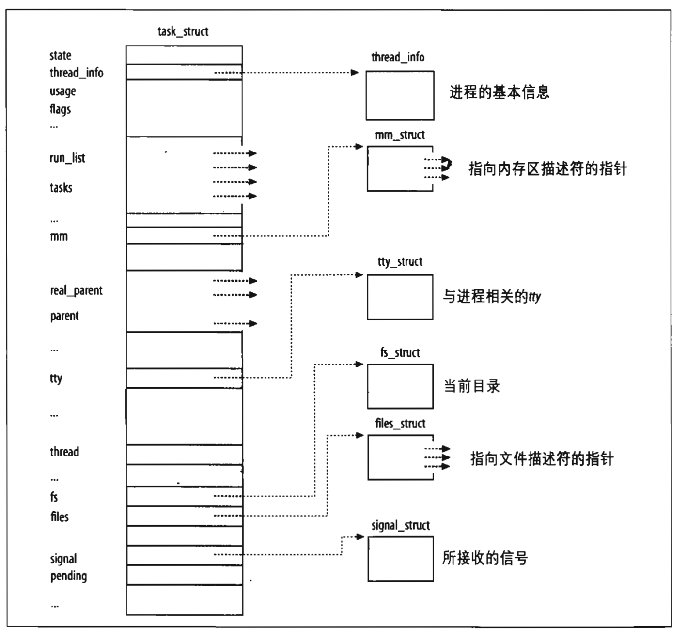
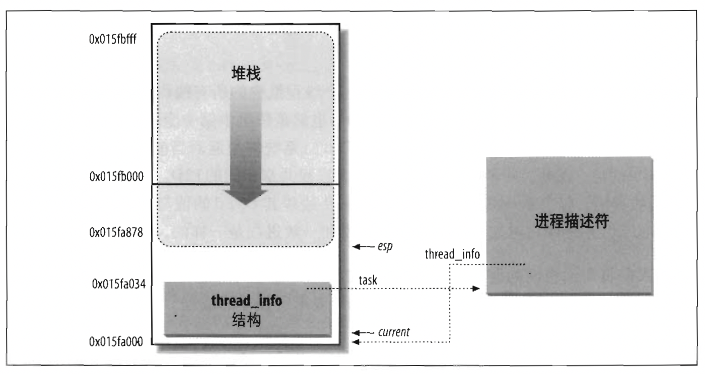
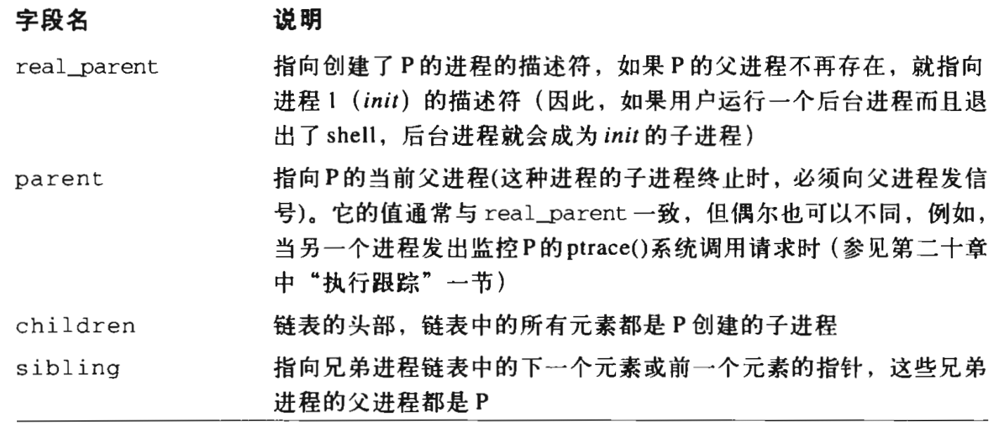
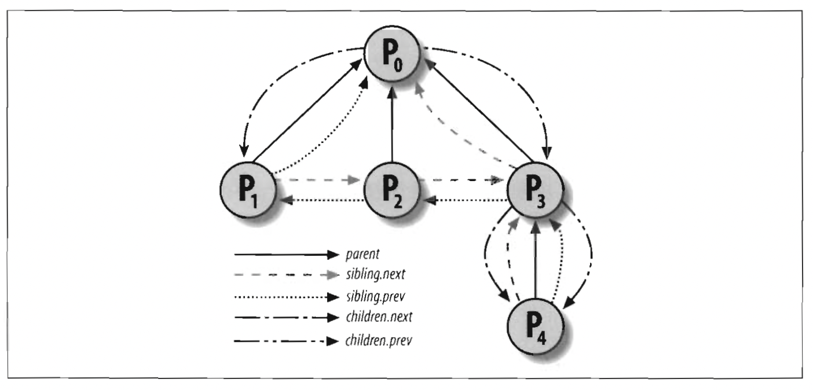
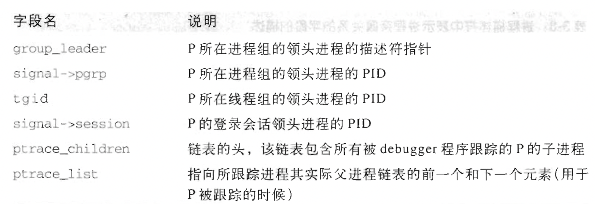
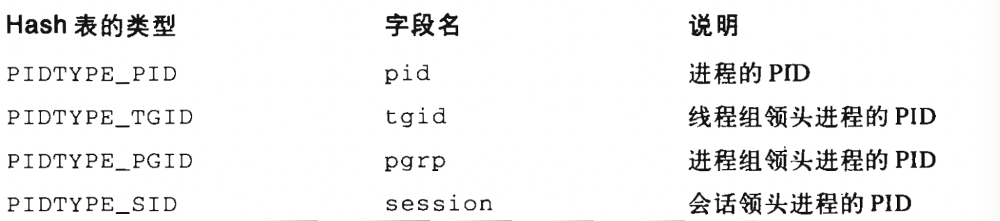
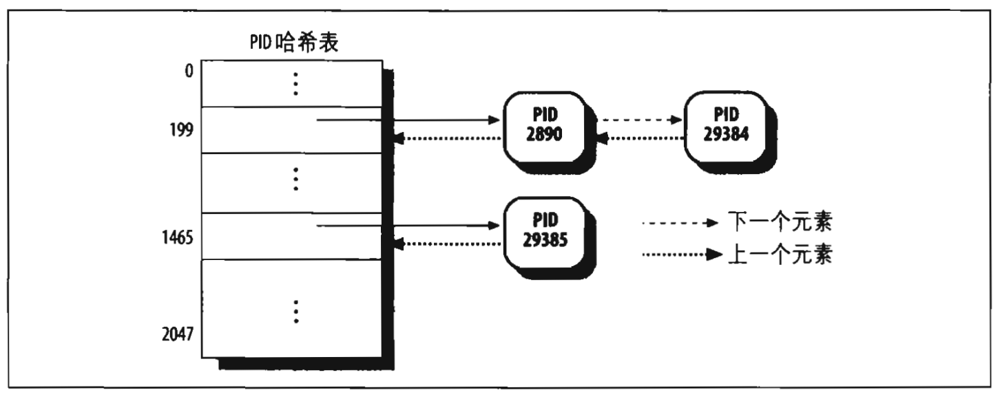
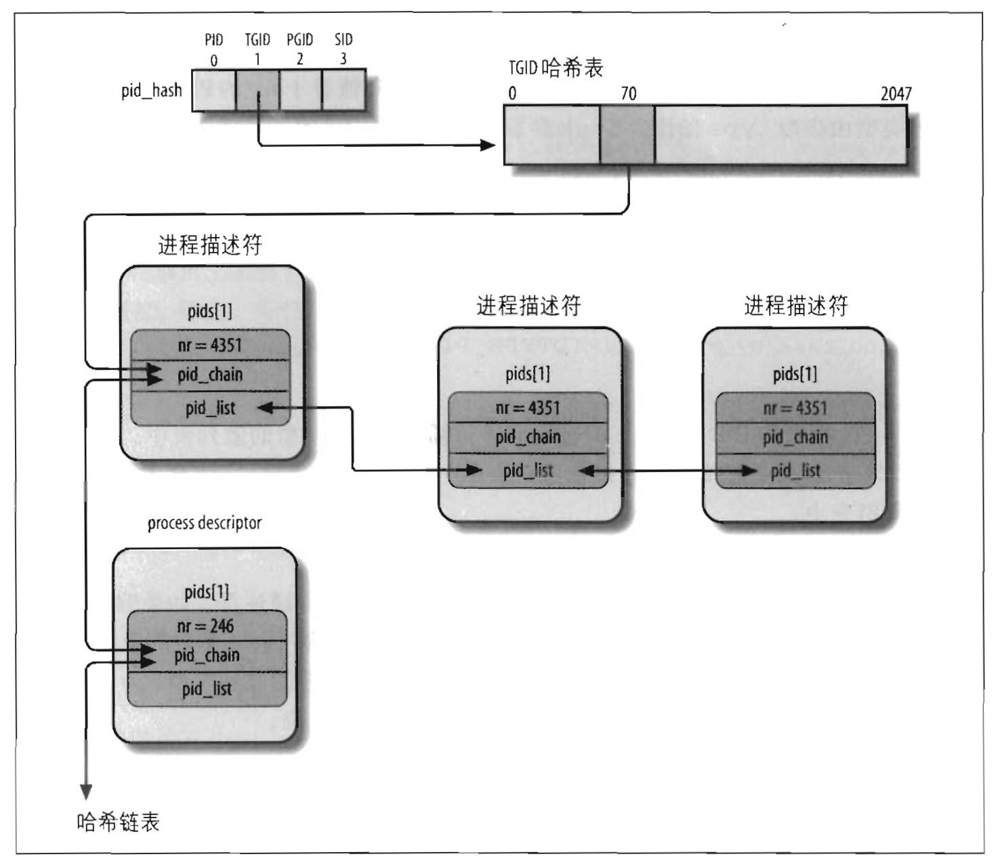

[TOC]

# 进程

## 进程、轻量级进程和线程

​		进程是程序执行时的一个实例。每个进程都有一个父进程。从内核来看，进程的目的就是担当分配系统资源(cpu时间、内存等)的实体。

​		<u>当一个进程创建时，它几乎与父进程相同，是父进程地址空间的一个(逻辑)拷贝，并从进程创建系统调用的下一条指令开始执行与父进程相同的代码，但他们的数据是独立的。</u>

​		现代unix系统支持多线程应用程序——即共享应用程序的大部分数据结构。在这样的系统中，一个进程由几个用户线程组成，每个线程都代表进程的一个执行流。Linux中，多线程应用是一个普通进程。多个执行刘的创建、处理、调度整个都是在用户态进行的(通常使用 posix 的 pthread 库)。

​		linux使用轻量级进程（lightweight process）对多线程应用程序提供更好的支持。两个轻量级进程基本上可以共享一些资源，诸如地址空间、打开的文件等等。只要其中一个修改共享资源。另一个就立即查看这种修改。

​		<u>实现多线程应用的一个简单方式就是把轻量级进程与每个线程关联起来。这样线程之间就能通过简单地共享同一地址空间、同一打开文件集来访问相同的应用程序数据结构集；同时每个线程都可以由内核独立调度，睡眠了一个线程另一个也是可以运行的。</u>

## 进程描述符

​		内核为了管理进程必须知道进程的优先级、运行状态、地址空间等等，这就是**<u>进程描述符（process descriptor）</u>**，里面有很多描述进程信息的字段和指针。



​		上图右边的 6 个数据结构涉及进程所拥有的特殊资源，我们先讨论两个：进程的状态和父子关系：

### 进程的状态

​		进程描述符的 state 字段描述了进程当前所处的状态。它由一组标志组成，其中每个标志描述一种可能的进程状态。在 linux 中，这些状态时互斥的，因此只能放置一种状态。进程可能的状态：

- **<u>可运行状态（TASK_RUNNING）</u>**
  进程要么正在 cpu 上运行，要么准备执行。

- **<u>可中断的等待状态（TASK_INTERRUPTIBLE）</u>**
  进程被挂起，直到某个条件为真。产生一个硬件中断，释放进程正等待的系统资源，或传递一个信号都是**<u>可以唤醒进程</u>**的条件。

- **<u>不可中断的等待状态（TASK_UNINTERRUPTIBLE）</u>**

  与可中断的等待状态类似，但信号传进睡眠程序**<u>不能改变它现有状态</u>**。

- **<u>暂停状态（TASK_STOPPED）</u>**

  进程的执行被暂停。当进程接收到 SIGSTOP、SIGTSTP、SIGTIN、SIGTTOU信号后，进入**<u>暂停状态</u>**。

- **<u>跟踪状态（TASK_TRACED）</u>**
  进程的执行由 debugger 程序暂停。当一个进程被另一个进程监控时（例如debug监控一个程序时），**<u>任何信号</u>**都可以把这个进程置于 TASL_TRACED 状态。

​		还有两个进程状态时既可以放在 state 字段中，也可以存放在 exit_state 字段中。从这两个字段的名称可以看出，只有当进程的执行被终止时，进程的状态才会改变为这两种状态中的一种：

- 僵死状态（EXIT_ZOMBIE）
  进程的执行被终止，但是，父进程还没发布 wait4() 或 waitpid() 系统调用返回有关死亡继承的信息。<u>发布 wait() 类系统调用前，内核不能丢弃包含死亡进程中的数据，因为父进程可能还需要它</u>。

- 僵死撤销状态（EXIT_DEAD）

  <u>最终状态：父进程**刚**发出 wait4()、waitpid() 系统调用，因此进程由系统删除。为了放置其他线程在同一个进程上也执行 wait() 类系统调用，而把进程的状态由僵死状态改为僵死撤销状态。</u>

### 标识一个进程

​		除了进程描述符用来记录进程信息，还有一个叫做进程标识符process ID(或 PID)的数来标识进度，PID 存放在进程描述符的 pid 字段中。

​		另外，同进程中的所有线程应该拥有相同的 pid，linux中为此引入线程组的表示。一个线程组中的所有线程使用和该线程组的领头线程相同的 pid，也就是该组第一个轻量级进程的 PID，他被存入进程描述符的 tgid 字段中。

### 进程描述符处理

​		内核必须能够同时处理很多进程，并把**<u>进程描述符存放在动态内存中，而不是放在永久分配给内核的内存中。</u>**（放在内核态堆中？）

​		**<u>对于每个进程来说，linux 都把两个不同的数据结构紧凑的存放在一个单独为进程分配的存储区域内：一个是内核态的进程堆栈，另一个是紧挨着进程描述符的小数据结构 thread_info，叫做线程描述符，这块存储区域通常大小为两个页框（8192个字节）。考虑到效率因素，内核让这 8k 空间连续并让第一个页框的起始地址为 2^13 的倍数</u>**。

​		内核态的进程访问处于内核数据段的栈，这个栈不同与用户态进程所用的栈。因为内核控制路径使用很少的栈，只需要几千个字节的内核堆栈，所以 8k 足够。



​		上图显示了 8k 内存中存放两种数据结构的方式。esp 是 cpu 栈指针，用来存放栈顶单元的地址。

### 进程链表

​		进程链表把所有进程的描述符链接起来。每个 task_struct 结构都包含一个 list_head 类型的 tasks 字段。

​		进程链表的头是 init_task 描述符，它是所谓的0进程或 swapper 进程的进程描述符。 

### TASK_RUNNNING 状态的进程链表

​		当内核寻找一个新进程在 CPU 上面运行时，必须只考虑可运行的进程（就是处在 TASK_RUNNNING 的进程）	。

​		以前的 linux 是维护一个优先运行队列，但是开销太大。现在的方式是针对不同的运行优先级分成不同的运行链表(140个)。甚至在多处理器中，每个 cpu 都有自己的运行队列，即它自己的进程链表集。

### 进程间的关系

​		程序创建的进程具有父子关系。如果一个进程创建多个子进程，则子进程之间具有兄弟关系。进程 0 和 1 是由内核创建的，进程 1 ( init )是所有进程的祖先。







### Pid 哈希表及链表

​		在一些情况下，内核希望通过进程的 pid 导出进程对应的描述符指针。例如，当 p1 进程希望向另一个进程 p2 发生一个信号时， p1 调用 kill() 系统调用，其参数为 P2 的 pid，内核就希望通过 p2 的pid 知道进程描述符。

​		顺序扫描进程链表是想当低效的。为了加速查找，引入了 4 个散列表。需要 4 个散列表是因为进程描述符包含了表示不团类型 pid 的字段(如下图)，且每种类型的 pid 需要它自己的散列表。



​		内核初始化期间动态的为 4 个散列表分配控件，并把它们的地址存入 pid_hash 数组。散列表的长度依赖可用 RAM 的容量，例如：一个 512MB 的 RAM ，那么每个散列表就被存在 4 个页框中，可以拥有 2048 个表项。

​		linux 利用链表来处理冲突的 pid：每一个表项都是由冲突的进程描述符组成的双向链表。





​		上图给出 PIDTYPE_TGID 类型散列表的例子。pid_hash 数组的第二个元素存放散列表的地址。

### 如何组织链表

​		运行队列链表把处于 TASK_RUNNING 状态的所有进程组织在一起。当要把其他状态的进程进行分组时，不同的状态要求不同的处理方式，linux 选择了下列之一：

- 没有为处于 TASK_STOPPED、EXIT_ZOMBIE 或 EXIT_DEAD 状态的进程建立专门的链表。由于对处于暂停、僵死、死亡状态进程的访问比较简单，或者通过 pid ，或者通过特定父进程的子进程链表，所以不必对着三种状态进行分组。
- 没有为处于、状态的进程建立专门的链表。由于对处于暂停、僵死、死亡状态进程的访问比较简单，或者通过 pid ，或者通过特定父进程的子进程链表，所以不必对这三种状态进程分组。

#### 等待队列

​		进程经常需要等待某些事情的发生，比如等待一个磁盘操作的停止，等待系统释放资源等。等待队列实现了在事件上的条件等待：<u>希望等待特定事件的进程把自己放进合适的等待队列，并放弃控制权。</u>

​		因此，等待队列表示一组睡眠的进程，当某一条件为真时，内核唤醒他们。

​		有时，等待队列等到一个资源时，如果唤醒了很多队列，但又因为竞争只有一个进程获得了资源，这时其他进程又需要回去睡眠了。因此，睡眠进程分为两种：互斥进程和非互斥进程。互斥进程 (flags = 1) 内核选择一个唤醒，非互斥进程 (flags = 0) 总是全部唤醒。


## 进程切换

​		为了控制进程的执行，内核必须有能力挂起正在 CPU 上的运行的进程，并恢复以前挂起的某个进程的执行。这种行为称为进程切换，任务切换或者上下文切换。

#### 硬件上下文

​		进程在恢复时，需要装入寄存器的一组数据称为硬件上下文。在 linux 中，进程硬件上下文的一部分在 TSS 段，而剩余部分再内核态堆栈中。

​		linux 2.6后使用软件执行进程切换，使用 mov 指令进行切换，可以检查段寄存器的值。

​		**<u>进程切换只发生在内核态。在执行进程切换之前，用户态进程使用的所有寄存器都保存在内核态堆上，这也包括用户态堆栈指针的地址。</u>**

#### 执行进程切换

```c++
#define switch_to(prev, next, last)     \
do {         \
/*        \
  * Context-switching clobbers(彻底击败) all registers, so we clobber \
  * them explicitly, via unused output variables.  \
  * (EAX and EBP is not listed because EBP is saved/restored \
  * explicitly for wchan access and EAX is the return value of \
  * __switch_to())      \
  */        \
unsigned long ebx, ecx, edx, esi, edi;    \
         \
asm volatile("pushfl\n\t"  /* save    flags */ \
       "pushl %%ebp\n\t"  /* save    EBP   */ \
       "movl %%esp,%[prev_sp]\n\t" /* save    ESP   */ \
       "movl %[next_sp],%%esp\n\t" /* restore ESP   */ \
       "movl $1f,%[prev_ip]\n\t" /* save    EIP   */ \
       "pushl %[next_ip]\n\t" /* restore EIP   */ \
       "jmp __switch_to\n" /* regparm call  */ \
       "1:\t"      \
       "popl %%ebp\n\t"  /* restore EBP   */ \
       "popfl\n"   /* restore flags */ \
         \
       /* output parameters */                       \
       : [prev_sp] "=m" (prev->thread.sp),  \
       /*m表示把变量放入内存，即把[prev_sp]存储的变量放入内存，最后再写入prev->thread.sp*/\
         [prev_ip] "=m" (prev->thread.ip),  \
         "=a" (last),                                           \
         /*=表示输出,a表示把变量last放入ax,eax = last*/         \
         \
         /* clobbered output registers: */  \
         "=b" (ebx), "=c" (ecx), "=d" (edx),  \
         /*b 变量放入ebx,c表示放入ecx，d放入edx,S放入si,D放入edi*/\
         "=S" (esi), "=D" (edi)    \
                \
         /* input parameters: */    \
       : [next_sp]  "m" (next->thread.sp),  \
       /*next->thread.sp 放入内存中的[next_sp]*/\
         [next_ip]  "m" (next->thread.ip),  \
                \
         /* regparm parameters for __switch_to(): */ \
         [prev]     "a" (prev),    \
         /*eax = prev  edx = next*/\
         [next]     "d" (next)    \
         \
       : /* reloaded segment registers */   \
   "memory");     \
} while (0)
```

​		进程切换调度过程：

​		 **schedule() --> context_switch() --> switch_to --> __switch_to()**

​		这里面，**<u>schedule() 是主调度函数，涉及到一些调度算法</u>**，这里不讨论。当schedule() 需要暂停 A 进程的执行而继续 B 进程的执行时，就发生了进程之间的切换。

每个进切换由两步组成：

1、切换页全局目录以安装一个新的地址空间；

2、切换内核态堆栈和硬件上下文，因为硬件上下文提供了内核执行新进程所需要的所有虚心，包含 CPU 寄存器。

​		这个切换工作由 context_switch() 完成。其中 switch_to 和__switch_to()主要完成第二部分。更详细的，__**<u>switch_to()主要完成硬件上下文切换</u>**，**<u>switch_to主要完成内核堆栈切换。</u>**

#### switch_to 宏

​		进程切换的第二步由 switch_to 宏执行。

​		**<u>阅读 switch_to 时请注意：这是一个宏，不是函数，它的参数 prev, next, last 不是值拷贝，而是它的调用者 context_switch() 的局部变量。局部变量是通过 %ebp 寄存器来索引的，也就是通过 n(%ebp) ，n是编译时决定的，在不同的进程的同一段代码中，同一局部变量的 n 是相同的。在 switch_to 中，发生了堆栈的切换，即 ebp 发生了改变，所以要格外留意在任一时刻的局部变量属于哪一个进程。</u>**

​		关于__switch_to() 这个函数的调用，并不是通过普通的 call 来实现，而是直接jmp，函数参数也并不是通过堆栈来传递，而是通过寄存器来传递。

switch_to 切换主要有以下三部分：

 

|    进程切换    | 即esp的切换  | 由于从esp可以找到进程的描述符                   |
| :------------: | ------------ | ----------------------------------------------- |
| 硬件上下文切换 | _switch_to() | 以前通过 x86 硬件支持，现在使用软件切换         |
|   堆栈的切换   | 即ebp的切换  | ebp是栈底指针，它确定了当前变量空间属于哪个进程 |

 		上面的四个步骤中，有三个是在 <u>switch_to 宏</u>中完成，硬件上下文切换由__switch_to() 函数完成。

 下面来具体看 switch_to 从 A 进程切换到 B 进程的步骤。

**step1**:复制两个变量到寄存器：

  [prev] "a" (prev)

  [next] "d" (next)

​	即:

  eax <== prev_A 或 eax <==%p(%ebp_A)

  edx <== next_A 或 edx <==%n(%ebp_A)

​	这里 prev 和 next 都是 A 进程的局部变量。

​	现在 eax 中保存 prev，ebx 中保存 next 。其中 eax 中始终都保持 prev，最后把该值交给 last

 

**step2**:保存进程 A 的 ebp 和 eflags

  pushfl

  pushl  %ebp

​	注意，因为现在 esp 还在 A 的堆栈中，所以这两个东西被保存到 A 进程的内核堆栈中。

 

**step3**:保存当前 esp 到 A 进程内核描述符中：

  "movl  %%esp, %[prev_sp] \n\t"  /* save  ESP  */

​	它可以表示成： prev_A->thread.sp <== esp_A

​	在调用 switch_to 时，prev 是指向 A 进程自己的进程描述符的。

 

**step4**:从 next（进程B）的描述符中取出之前从 B 切换出去时保存的 esp_B。

  "movl  %[next_sp], %%esp\n\t" /* restore ESP */

  它可以表示成：esp_B <== next_A->thread.sp

  注意，在 A 进程中的 next 是指向 B 的进程描述符的。

​	从这个时候开始，**CPU 当前执行的进程已经是 B 进程了**，**因为 esp 已经指向 B 的内核堆栈。**但是，现在的 ebp 仍然指向 A 进程的内核堆栈，所以所有局部变量仍然是 A 中的局部变量，比如 next 实质上是 %n(%ebp_A)，也就是 next_A，即指向 B 的进程描述符。

  

**step5**: 把标号为 1 的指令地址保存到 A 进程描述符的 ip 域：

  "movl  $1f, %[prev_ip]\n\t "  /* save  EIP  */

​	它可以表示成：prev_A->thread.ip <== %1f，当 A 进程下次被 switch_to 回来时，会从这条指令开始执行。具体方法看后面被切换回来的 B 的下一条指令。

 

**step6**: 将返回地址保存到堆栈，然后调用 __ switch_to() 函数， __switch_to() 函数完成硬件上下文切换。 

  "pushl  %[next_ip]\n\t"  /* restore EIP  */

  "jmp  __switch_to\n"  /* regparm call */

​	这里，如果之前 B 也被 switch_to 出去过，那么 [next_ip] 里存的就是下面这个 1f 的标号，但如果进程 B 刚刚被创建，之前没有被 switch_to 出去过，那么[next_ip] 里存的将是 ret_ftom_fork（参看 copy_thread() 函数）。这就是这里为什么不用 call __ switch_to 而用 jmp，因为 call 会导致自动把下面这句话的地址 ( 也就是1:) 压栈，然后 __switch_to() 就必然只能 ret 到这里，而无法根据需要 ret 到 ret_from_fork。

​	另外请注意，这里 __switch_to() 返回时，将返回值 prev_A 又写入了 %eax，这就使得在 switch_to 宏里面 eax 寄存器始终保存的是 prev_A 的内容，或者，更准确的说，是指向 A 进程描述符的“指针”。这是有用的，下面step8中将会看到。

 

**step7**: 从 __switch_to() 返回后继续从 1 : 标号后面开始执行，修改 ebp 到 B 的内核堆栈，恢复 B 的 eflags：

  "popl  %%ebp\n\t"    /* restore EBP  */  

  "popfl\n"      /* restore flags */

​	如果从__switch_to()返回后从这里继续运行，那么说明在此之前B肯定被switch_to调出过，因此此前肯定备份了 ebp_B 和 flags_B，这里执行恢复操作。

​	**注意，这时候 ebp 已经指向了 B 的内核堆栈，所以上面的 prev, next 等局部变量已经不是 A 进程堆栈中的了，而是 B 进程堆栈中的 ( B 上次被切换出去之前也有这两个变量，所以代表着 B 堆栈中 prev、next 的值了) ，因为 prev == %p(%ebp_B)，而在B上次被切换出去之前，该位置保存的是B进程的描述符地址。**如果这个时候就结束 switch_to 的话，在后面的代码中（即 context_switch() 函数中 switch_to 之后的代码）的 prev 变量是指向 B 进程的，因此，进程 B 就不知道是从哪个进程切换回来。而从 context_switch() 中 switch_to 之后的代码中，我们看到 finish_task_switch(this_rq(), prev) 中需要知道之前是从哪个进程切换过来的，因此，我们必须想办法保存 A 进程的描述符到 B 的堆栈中，这就是 last 的作用。

 

**step8**:将 eax 写入 last，以在 B 的堆栈中保存正确的 prev 信息。

  "=a" (last) 即 last_B <== %eax

​	而从 context_switch() 中看到的调用 switch_to 的方法是：

  switch_to(prev, next, prev);

​	**所以，这里面的 last 实质上就是 prev，因此在 switch_to 宏执行完之后，prev_B 就是正确的 A 的进程描述符了。**

（既然一样，为什么不直接写入 prev 中，last 不就多余了么？？？？）

​	这里，last 的作用相当于把进程 A 堆栈中的 A 进程描述符地址复制到了进程 B 的堆栈中。

 

​		至此，switch_to 已经执行完成，A 停止运行，而开始了 B。在以后，可能在某一次调度中，进程 A 得到调度，就会出现 switch_to(C, A) 这样的调用，这时，A 再次得到调度，得到调度后，A 进程从 context_switch() 中 switch_to 后面的代码开始执行，这时候，它看到的 prev_A 将指向 C 的进程描述符。


​		如果读者不是十分清楚这个过程，最好自己画一下堆栈的变化，注意，这里有两个堆栈，在这个过程中，有一个时期 esp 和 ebp 并不在同一个堆栈上，要格外注意这个时期里所有涉及堆栈的操作分别是在哪个堆栈上进行的。

​		记住一个简单的原则即可，**pop/push** 这样的操作，都是对 **esp** 所指向的堆栈进行的，这些操作同时也会改变 **esp** 本身，除此之外，其它关于变量的引用，都是对 **ebp** s所指向的堆栈进行的。 


下面我们从 switch_to 被调用的情况来看一下这个执行过程。

 		这里，为了便于理解，我们首先忽略 switch_t o中的具体细节，仅仅把它当作一个普通的指令。

​		对 A 进程来说，它始终没有感觉到自己被打断过，它认为自己一直是不间断执行的。switch_to 这条“指令”，除了改变了 A 进程中的 prev 变量外，对 A 没有其它任何影响。在系统中任何进程看到的都是这个样子，所有进程都认为自己在不间断的独立运行。

​		然而，实际上 switch_to 的执行并不是一瞬间完成的，switch_to 执行花了很长很长的时间，但是，在执行完 switch_to 之后，这段时间被从 A 的记忆中抹除，所以 A 并没有觉察到自己被打断过。

​		接着，我们再来看这个 “ 神奇 ” 的 switch_to。switch_to 是从 A 进程到 B 进程的过渡，我们可以认为在 switch_to 这个点上，A 进程被切出，B 进程被切入。但是，如果把粒度放小到 switch_to 里面的单个汇编语句，这个界限就不明显了。进入 switch_to 的宏里面之后，首先 pushfl 和 pushl ebp 肯定仍然属于进程 A，之后把 esp 指向了 B 的堆栈，严格的说，从此时开始的指令流都属于 B 进程了。但是，这个时候 B 进程还没有完全准备好继续运行，因为 ebp、硬件上下文等内容还没有切换成 B 的，剩下的部分宏代码就是完成这些事情。

​		另外需要格外强调的是，这部分代码是内核代码，它们跟用户代码不在同一个代码段，所有进程在内核态共用这一段内核代码。这里涉及到的所有堆栈都是内核堆栈，而不涉及用户堆栈。进程切换时需要的页表项的切换不是在这里面做的。

 		

​		我们现在再向“上“看，从一个高级语言程序员的角度看，内核态的东西就好比这里的 switch_to 一样，对高级语言程序员是透明的。高级语言程序员始终认为自己的进程在不间断连续执行，而调度点的语句以及调度点之后的整个过程对该程序是完全没有影响的。