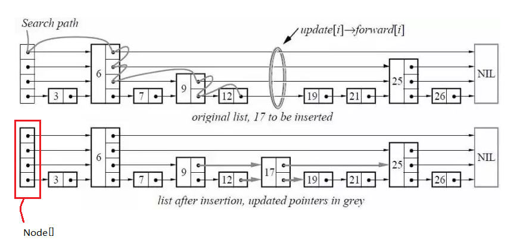

[TOC]

基础知识见：[其他：※跳表.md](./其他：※跳表.md)

# Skip list

​		**Skip list(跳跃表）是一种可以代替平衡树的数据结构。**Skip lists 应用概率保证平衡，平衡树采用严格的旋转（比如平衡二叉树有左旋右旋）来保证平衡，因此 Skip list 比较容易实现，而且相比平衡树有着较高的运行效率。

​		从概率上保持数据结构的平衡比显式的保持数据结构平衡要简单的多。**对于大多数应用，用 skip list 要比用树更自然，算法也会相对简单**。由于 skip list 比较简单，实现起来会比较容易，虽然和平衡树有着相同的时间复杂度(O(logn))，但是 skip list 的常数项相对小很多。skip list 在空间上也比较节省。一个节点平均只需要 1.333 个指针（甚至更少），并且不需要存储保持平衡的变量。




## 源码分析

LevelDB 中对 SkipList 的实现增加了多线程并发访问方面的优化的代码，提供以下保证：

1. Write：在修改跳表时，需要在用户代码侧加锁。
2. Read：在访问跳表（查找、遍历）时，只需保证跳表不被其他线程销毁即可，不必额外加锁。

也就是说，**<u>用户侧只需要处理写写冲突，LevelDB 跳表保证没有读写冲突</u>**。

这是因为在实现时，LevelDB 做了以下假设（Invariants）：

1. 除非跳表被销毁，跳表节点只会增加而不会被删除，因为跳表对外根本不提供删除接口。
2. 被插入到跳表中的节点，除了 next 指针其他域都是不可变的，并且只有插入操作会改变跳表。

### 接口

​		LevelDB 的 Skip List 对外提供的接口主要有三个，分别是插入、查询和遍历。

```cpp
// 插入 key 到跳表中.
// 要求: 不能够插入和跳表中的节点判等的 key.
template <typename Key, class Comparator>
void SkipList<Key, Comparator>::Insert(const Key& key)

// 当且仅当跳表中有和给定 key 判等的节点才返回真.
template <typename Key, class Comparator>
bool SkipList<Key, Comparator>::Contains(const Key& key) const

// 返回给定跳表的迭代器
template <typename Key, class Comparator>
inline SkipList<Key, Comparator>::Iterator::Iterator(const SkipList* list)
```

​		为了灵活适配，LevelDB 的 SkipList 使用了类模板（[template class](https://link.zhihu.com/?target=https%3A//en.wikipedia.org/wiki/Template_(C%2B%2B))），使得调用方可以自定义 Key 的类型，并且基于该 Key 定制比较类 Comparator。

​		在详细分析这几个接口之前，首先看下跳表的基本构成元素 `SkipList::Node` 的数据结构，代码里有一些多线程读写共享变量时进行同步的代码。这里主要涉及到指令重排的一些内容，下面稍微展开说一下。

​		我们知道，编译器/CPU 在保在达到相同效果的情况下会按需（加快速度、内存优化等）对指令进行重排，这对单线程来说的确没什么。但是对于多线程，指令重排会使得多线程间代码执行顺序变的各种反直觉。用 go 代码[举个例子](https://link.zhihu.com/?target=https%3A//golang.org/ref/mem)：

```go
var a, b int

func f() {
    a = 1
    b = 2
}

func g() {
    print(b)
    print(a)
}

func main() {
    go f()
    g()
}
```

​		该代码片段可能会打印出 `2 0`！

​		原因在于编译器/CPU 将 `f()` 赋值顺序重排了或者将 `g()` 中打印顺序重排了。这就意味着你跟随直觉写出的多线程代码，可能会出问题。因为你无形中默认了单个线程中执行顺序是代码序，多线程中虽然代码执行会产生交错，但仍然保持各自线程内的代码序。实则不然，<u>由于编译器/CPU 的指令重排，如果不做显式同步，你不能对多线程间代码执行顺序有任何假设。</u>

​		回到 LevelDB 跳表代码上，主要涉及 C++11 中 atomic 标准库中新支持的几种 memory order，规定了一些指令重排方面的限制，仅说明下用到的三种：

1. `std::memory_order_relaxed`：不对重排做限制，只保证相关共享内存访问的原子性。
2. `std::memory_order_acquire`: 用在 load 时，保证同线程中该 load 之后的对相关内存读写语句不会被重排到 load 之前，并且其他线程中对同样内存用了 store release 都对其可见。
3. `std::memory_order_release`：用在 store 时，保证同线程中该 store 之后的对相关内存的读写语句不会被重排到 store 之前，并且该线程的所有修改对用了 load acquire 的其他线程都可见。

```cpp
template <typename Key, class Comparator>
struct SkipList<Key, Comparator>::Node {
  explicit Node(const Key& k) : key(k) {}

  Key const key;

  Node* Next(int n) {
    assert(n >= 0);
    return next_[n].load(std::memory_order_acquire);
  }
  void SetNext(int n, Node* x) {
    assert(n >= 0);
    next_[n].store(x, std::memory_order_release);
  }

  // 不带内存屏障版本的访问器。内存屏障（Barrier）是个形象的说法，也即加一块挡板，阻止重排/进行同步
  Node* NoBarrier_Next(int n) {
    assert(n >= 0);
    return next_[n].load(std::memory_order_relaxed);
  }
  void NoBarrier_SetNext(int n, Node* x) {
    assert(n >= 0);
    next_[n].store(x, std::memory_order_relaxed);
  }

 private:
  // 指针数组的长度即为该节点的 level，next_[0] 是最低层指针.
  std::atomic<Node*> next_[1]; // 指向指针数组的指针
};
```

### 查找

​		查找是插入的基础，每个节点要先找到合适位置，才能进行插入。因此 LevelDB 抽象出了一个公用函数： `FindGreaterOrEqual` ：

```cpp
template <typename Key, class Comparator>
bool SkipList<Key, Comparator>::Contains(const Key& key) const {
  Node* x = FindGreaterOrEqual(key, nullptr);
  if (x != nullptr && Equal(key, x->key)) {
    return true;
  } else {
    return false;
  }
}
```

​		该函数的含义为：在跳表中查找不小于给 Key 的第一个值，如果没有找到，则返回 nullptr。如果参数 `prev` 不为空，在查找过程中，记下待查找节点在各层中的前驱节点。显然，如果查找操作，则指定 `prev = nullptr` 即可；若要插入数据，则需传入一个合适尺寸的 `prev` 参数。

```cpp
template <typename Key, class Comparator>
typename SkipList<Key, Comparator>::Node*
SkipList<Key, Comparator>::FindGreaterOrEqual(const Key& key, Node** prev) const {
  Node* x = head_;                // 从头结点开始查找
  int level = GetMaxHeight() - 1; // 从最高层开始查找
  while (true) {
    Node* next = x->Next(level);  // 该层中下一个节点
    if (KeyIsAfterNode(key, next)) {
      x = next;                   // 待查找 key 比 next 大，则在该层继续查找
    } else {
      if (prev != nullptr) prev[level] = x;

      if (level == 0) {           // 待查找 key 不大于 next，则到底返回
        return next;
      } else {                    // 待查找 key 不大于 next，且没到底，则往下查找
        level--;
      }
    }
  }
}
```

该过程借用论文中图示如下：


跳表查找和插入过程

### 插入

​		在 `FindGreaterOrEqual` 基础上，记下待插入节点的各层次前驱节点，比如上图中，调用 `FindGreaterOrEqual(17, prev)` 后 `prev = [12, 9, 6, 6]`。插入代码如下：

```cpp
template <typename Key, class Comparator>
void SkipList<Key, Comparator>::Insert(const Key& key) {
  // 待做(opt): 由于插入要求外部加锁，因此可以使用 NoBarrier_Next 的 FindGreaterOrEqual 以提高性能
  Node* prev[kMaxHeight]; // 长度设定简单粗暴，直接取最大值（kMaxHeight = 12）肯定没错。
  Node* x = FindGreaterOrEqual(key, prev);

  // LevelDB 跳表要求不能插入重复数据
  assert(x == nullptr || !Equal(key, x->key));

  int height = RandomHeight(); // 随机获取一个 level 值
  if (height > GetMaxHeight()) { // GetMaxHeight() 为获取跳表当前高度
    for (int i = GetMaxHeight(); i < height; i++) {
      prev[i] = head_;
    }
    // 此处不用为并发读加锁。因为并发读在（在另外线程中通过 FindGreaterOrEqual 中的 GetMaxHeight）
    // 读取到更新后跳表层数，但该节点尚未插入时也无妨。因为这意味着它会读到 nullptr，而在 LevelDB
    // 的 Comparator 设定中，nullptr 比所有 key 都大。因此，FindGreaterOrEqual 会继续往下找，
    // 符合预期。
    max_height_.store(height, std::memory_order_relaxed);
  }

  x = NewNode(key, height);
  for (int i = 0; i < height; i++) {
    // 此句 NoBarrier_SetNext() 版本就够用了，因为后续 prev[i]->SetNext(i, x) 语句会进行强制同步。
    // 并且为了保证并发读的正确性，一定要先设置本节点指针，再设置原条表中节点（prev）指针
    x->NoBarrier_SetNext(i, prev[i]->NoBarrier_Next(i));
    prev[i]->SetNext(i, x);
  }
}
```

​		LevelDB 跳表实现的**复杂点**在于**<u>提供不加锁的并发读的正确性保证</u>**。但算法的**关键点**在于每个节点插入时，如何确定新插入节点的层数，以使跳表满足概率均衡，进而提供高效的查询性能。即 `RandomHeight` 的实现：

```cpp
template <typename Key, class Comparator>
int SkipList<Key, Comparator>::RandomHeight() {
  // 每次以 1/4 的概率增加层数
  static const unsigned int kBranching = 4;
  int height = 1;
  while (height < kMaxHeight && ((rnd_.Next() % kBranching) == 0)) {
    height++;
  }
  assert(height > 0);
  assert(height <= kMaxHeight);
  return height;
}
```

​		LevelDB 的采样较为稀疏，每四个采一个，且层数上限为 kMaxHeight = 12。具体实现过程即为构造 P = 3/4 的几何分布的过程。结果为所有节点中：3/4 的节点为 1 层节点，3/16 的节点为 2 层节点，3/64 的节点为 3 层节点，依次类推。这样平均每个节点含指针数 1/P = 4/3 = 1.33 个。当然，在论文中的 p 的含义为相邻两层间采样的比例，和我提到的 P 的关系为：p = 1-P。

​		选 p = 1/4 相比 p = 1/2 是用时间换空间，即只牺牲了一些常数的查询效率，换取平均指针数的减少，从而减小内存使用。论文中也推荐 p = 1/4 ，除非读速度要求特别严格。在此情况下，可以最多支持 n = (1/p)^kMaxHeight 个节点的情况，查询时间复杂度不退化。如果选 kMaxHeight = 12，则跳表最多可以支持 n = 4 ^ 12 = 16M 个值。

### 遍历

​		LevelDB 为跳表构造了一个内部类 Iterator，以 SkipList 作为构造函数参数，实现了 LevelDB 导出的 Iterator 接口的大部分函数，如 Next，Prev，Seek，SeekToFirst，SeekToLast 等等。

```cpp
template <typename Key, class Comparator>
inline SkipList<Key, Comparator>::Iterator::Iterator(const SkipList* list) {
  list_ = list;
  node_ = nullptr;
}

template <typename Key, class Comparator>
inline bool SkipList<Key, Comparator>::Iterator::Valid() const {
  return node_ != nullptr;
}

template <typename Key, class Comparator>
inline const Key& SkipList<Key, Comparator>::Iterator::key() const {
  assert(Valid());
  return node_->key;
}

template <typename Key, class Comparator>
inline void SkipList<Key, Comparator>::Iterator::Next() {
  assert(Valid());
  node_ = node_->Next(0);
}

template <typename Key, class Comparator>
inline void SkipList<Key, Comparator>::Iterator::Prev() {
  // 相比在节点中额外增加一个 prev 指针，我们使用从头开始的查找定位其 prev 节点
  assert(Valid());
  node_ = list_->FindLessThan(node_->key);
  if (node_ == list_->head_) {
    node_ = nullptr;
  }
}

template <typename Key, class Comparator>
inline void SkipList<Key, Comparator>::Iterator::Seek(const Key& target) {
  node_ = list_->FindGreaterOrEqual(target, nullptr);
}

template <typename Key, class Comparator>
inline void SkipList<Key, Comparator>::Iterator::SeekToFirst() {
  node_ = list_->head_->Next(0);
}

template <typename Key, class Comparator>
inline void SkipList<Key, Comparator>::Iterator::SeekToLast() {
  node_ = list_->FindLast();
  if (node_ == list_->head_) {
    node_ = nullptr;
  }
}
```

​		可以看出该迭代器没有为每个节点增加一个额外的 prev 指针以进行反向迭代，而是用了选择从 head 开始查找。这也是一种用时间换空间的取舍。当然，其假设是前向遍历情况相对较少。

其中 `FindLessThan` 和 `FindLast` 的实现与 `FindGreaterOrEqual` 思路较为相似，不再赘述。

```cpp
// Return the latest node with a key < key.
// Return head_ if there is no such node.
Node* FindLessThan(const Key& key) const;

// Return the last node in the list.
// Return head_ if list is empty.
Node* FindLast() const;
```

## 小结

跳表本质上是对链表的一种优化，通过逐层跳步采样的方式构建索引，以加快查找速度。使用概率均衡的思路，确定新插入节点的层数，使其满足集合分布，在保证相似的查找效率简化了插入实现。

LevelDB 的跳表实现还专门对多线程读做了优化，但写仍需外部加锁。在实现思路上，整体采用时间换空间的策略，优化内存使用。