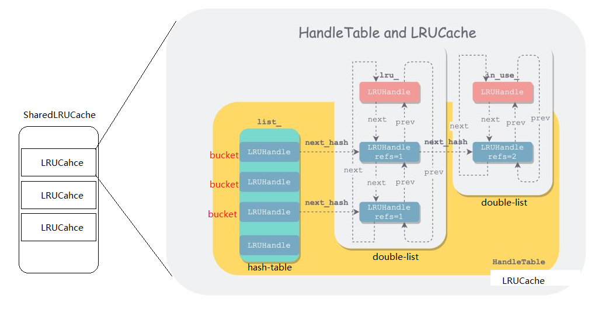
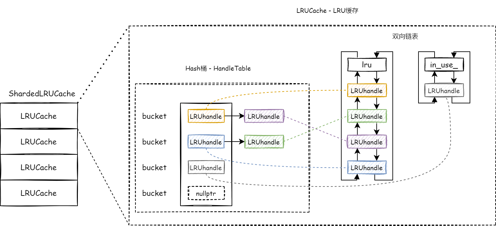
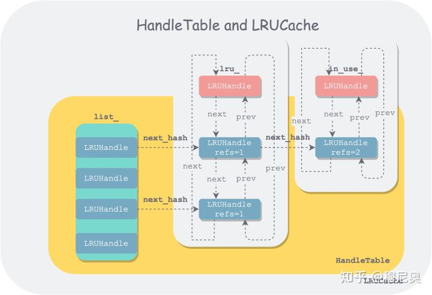
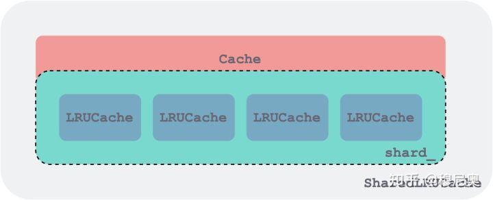

[toc]

# LRUCache


## 缓存使用

​		在分析 LRUCache 的实现之前，首先了解下 LRUCache 的使用方法，以明确 LRUCache 要解决的问题。以此为基础，我们才能了解为什么要这么实现，甚至更进一步，探讨有没有更好的实现。

​		首先来看下 LevelDB 的导出接口 [Cache]( [leveldb/cache.h at main · google/leveldb (github.com)](https://github.com/google/leveldb/blob/main/include/leveldb/cache.h) )：

```cpp
//   插入一个键值对（key，value）到缓存（cache）中，
// 并从缓存总容量中减去该键值对所占额度（charge） 。
//   返回指向该键值对的句柄（handle），调用者在用完句柄后，
// 需要调用 this->Release(handle) 进行释放。
//   在键值对不再被使用时，键值对会被传入的 deleter 参数
// 释放。
virtual Handle* Insert(const Slice& key, void* value, size_t charge,
                       void (*deleter)(const Slice& key, void* value)) = 0;

//   如果缓存中没有相应键（key），则返回 nullptr。
//   否则返回指向对应键值对的句柄（Handle）。调用者用完句柄后，
// 要记得调用 this->Release(handle) 进行释放。
virtual Handle* Lookup(const Slice& key) = 0;

// 释放 Insert/Lookup 函数返回的句柄
// 要求：该句柄没有被释放过，即不能多次释放
// 要求：该句柄必须是同一个实例返回的
virtual void Release(Handle* handle) = 0;

// 获取句柄中的值，类型为 void*（表示任意用户自定义类型）
// 要求：该句柄没有被释放
// 要求：该句柄必须由同一实例所返回
virtual void* Value(Handle* handle) = 0;

// 如果缓存中包含给定键所指向的条目，则删除之。
// 需要注意的是，只有在所有持有该条目句柄都释放时，该条目所占空间才会真正被释放
virtual void Erase(const Slice& key) = 0;

// 返回一个自增的数值 id。当一个缓存实例由多个客户端共享时，
// 为了避免多个客户端的键冲突，每个客户端可能想获取一个独有
// 的 id，并将其作为键的前缀。类似于给每个客户端一个单独的命名空间。
virtual uint64_t NewId() = 0;

// 驱逐全部没有被使用的数据条目
// 内存吃紧型的应用可能想利用此接口定期释放内存。
// 基类中的 Prune 默认实现为空，但强烈建议所有子类自行实现。
// 将来的版本可能会增加一个默认实现。
virtual void Prune() {}

// 返回当前缓存中所有数据条目所占容量总和的一个预估
virtual size_t TotalCharge() const = 0;
```

依据上述接口，可捋出 LevelDB 缓存相关需求：

1. 多线程支持
2. 性能需求
3. 数据条目的生命周期管理


 用状态机来表示 Cache 中的 Entry 的生命周期如下： 


​		综上所述，leveldb 的需求在普通 LRU 的基础上增加了引用计数，并且得支持多线程调用，多了许多状态。


## 思路总览

​		总体上来说，LevelDB 的 LRUCache 也使用了哈希表和双向链表的实现思路，但又有些不同：

1. 使用数组+链表处理冲突定制了一个极简哈希表，便于控制分配以及伸缩。
2. 多线程支持。了提高并发，引入了分片；为了区分是否被客户端引用，引入两个双向链表。

整个代码相当简洁，思想也比较直观。






### 定制简单哈希表

​		LevelDB 中哈希表保持桶的个数为 2 的次幂，从而使用位运算来通过键的哈希值快速计算出桶位置。通过 key 的哈希值来获取桶的句柄方法如下：

```cpp
LRUHandle** ptr = &list_[hash & (length_ - 1)];
```

​		每次调整时，在扩张时将桶数量增加一倍，在缩减时将桶数量减少一倍，并需要对所有数据条目进行重新分桶。

操作：

```c++
  LRUHandle* Insert(LRUHandle* h) {
    LRUHandle** ptr = FindPointer(h->key(), h->hash);
    LRUHandle* old = *ptr;
    h->next_hash = (old == nullptr ? nullptr : old->next_hash);
    *ptr = h;
    if (old == nullptr) {
      ++elems_;
      if (elems_ > length_) {
        // 由于每个缓存条目都相当大，我们的目标是较小的平均链表长度（<= 1）。
        Resize();
      }
    }
    return old;
  }

  LRUHandle* Remove(const Slice& key, uint32_t hash) {
    LRUHandle** ptr = FindPointer(key, hash);
    LRUHandle* result = *ptr;
    if (result != nullptr) {
      *ptr = result->next_hash;
      --elems_;
    }
    return result;
  }
```

内部函数：

```c++
  // Return a pointer to slot that points to a cache entry that
  // matches key/hash.  If there is no such cache entry, return a
  // pointer to the trailing slot in the corresponding linked list.
  LRUHandle** FindPointer(const Slice& key, uint32_t hash) {
    LRUHandle** ptr = &list_[hash & (length_ - 1)];
    while (*ptr != nullptr && ((*ptr)->hash != hash || key != (*ptr)->key())) {
      ptr = &(*ptr)->next_hash;
    }
    return ptr;
  }

  void Resize() {
    uint32_t new_length = 4;
    while (new_length < elems_) {
      new_length *= 2;
    }
    LRUHandle** new_list = new LRUHandle*[new_length];
    memset(new_list, 0, sizeof(new_list[0]) * new_length);
    uint32_t count = 0;
    for (uint32_t i = 0; i < length_; i++) {
      LRUHandle* h = list_[i];
      while (h != nullptr) {
        LRUHandle* next = h->next_hash;
        uint32_t hash = h->hash;
        LRUHandle** ptr = &new_list[hash & (new_length - 1)];
        h->next_hash = *ptr;
        *ptr = h;
        h = next;
        count++;
      }
    }
    assert(elems_ == count);
    delete[] list_;
    list_ = new_list;
    length_ = new_length;
  }
```


### 两个链表

​		LevelDB 使用两个双向链表保存数据，**缓存**中的所有数据要么在一个链表中，要么在另一个链表中，但不可能同时存在于两个链表中。这两个链表分别是：

1. **in-use 链表**。所有正在被客户端使用的数据条目（an kv item）都存在该链表中，该链表是无序的，因为在容量不够时，此链表中的条目是一定不能够被驱逐的，因此也并不需要维持一个驱逐顺序。
2. **lru 链表**。所有已经不再为客户端使用的条目都放在 lru 链表中，该链表按最近使用时间有序，当容量不够用时，会驱逐此链表中最久没有被使用的条目。

​        另外值得一提的是，哈希表中用来处理冲突的链表节点与双向链表中的节点使用的是同一个数据结构（`LRUHandle`），但在串起来时，用的是 `LRUHandle` 中不同指针字段。


## 数据结构

​		LRUCache 实现主要涉及到了四个数据结构：`LRUHandle`、`HandleTable`、`LRUCache` 和 `ShardedLRUCache`。前三者组织形式如下：




​		`ShardedLRUCache` 由一组 `LRUCache` 组成，每个 `LRUCache` 作为一个分片，同时是一个加锁的粒度，他们都实现了 `Cache` 接口。下图画了 4 个分片，代码中是 16 个。



### LRUHandle——基本数据单元

​		`LRUHandle` 是双向链表和哈希表的基本构成单位。其结构如下：

```cpp
// 双向链表和 HandleTable 中节点数据 - LRUHandle
struct LRUHandle {
  void* value;
  void (*deleter)(const Slice&, void* value); // 析构器，外部申请内存，引用计数为0调用
  LRUHandle* next_hash;  // 用于 hashtable 中链表处理冲突, 作为Hash桶单向链表节点的下一个节点
  LRUHandle* next;       // 用于双向链表中维护 LRU 顺序
  LRUHandle* prev;
  size_t charge;     // 目前没用，表权重
  size_t key_length; // key 的长度，LRUHandle 中的 data 域存放 key 数据，可动态扩展
  bool in_cache;     // 表示cache中是否有该元素，仅析构、相同 key 代替、需要淘汰时标记
  uint32_t refs;     // 引用计数
  uint32_t hash;     // Hash(key)保存一份避免多次求
  char key_data[1];  // key数据域

  Slice key() const {
    // next_ is only equal to this if the LRU handle is the list head of an
    // empty list. List heads never have meaningful keys.
    assert(next != this);
	
    return Slice(key_data, key_length);// 简单包装 key_data 域
  }
};
```

​		特别要注意的是，<u>`LRUHandle` 中的 `refs` 和我们前一小节中所画图中的状态机中 ref 含义并不一样。</u>LevelDB 实现时，把 Cache 的引用也算一个引用。因此在 `Insert` 时，会令 `refs` = 2，一个为客户端的引用，一个为 `LRUCache` 的引用。 `refs==1 && in_cache`即说明该数据条目只被 `LRUCache` 引用了。

​		这个设计开始看着有点别扭，但是想了想反而觉得很贴切自然。


### HandleTable——哈希表索引

```c++
// HandleTable 线程不安全，需要外部保证
class HandleTable {
private:
    uint32_t length_;   // hash桶大小
    uint32_t elems_;    // 元素个数
    LRUHandle **list_;  // hash桶链表，指针数组形式
public:
    // 构造默认为0，通过 resize 重新设置内存大小
    HandleTable() : length_(0), elems_(0), list_(nullptr) {
        Resize();
    }
    // 析构将桶全部删除
    ~HandleTable() {
        delete[] list_;
    }
private:
      // 扩桶
    void Resize() {
        // 默认最小桶为4，每次扩大增加一倍
        uint32_t new_length = 4;
        while (new_length < elems_) {
            new_length *= 2;
        }
        // 开辟堆空间，并且初始化为 0 
        LRUHandle **new_list = new LRUHandle *[new_length];
        memset(new_list, 0, sizeof(new_list[0]) * new_length);
        uint32_t count = 0;
        // 遍历老桶
        // 取老桶中头节点，放到新桶中
        // 注意使用二级指针，放到新桶时采用头插
        for (uint32_t i = 0; i < length_; i++) {
            LRUHandle *h = list_[i];
            while (h != nullptr) {
                LRUHandle *next = h->next_hash;
                uint32_t hash = h->hash;
                LRUHandle **ptr = &new_list[hash & (new_length - 1)];
                // 将取出的老节点执行，新桶的第一个节点
                h->next_hash = *ptr;
                // 设置新桶的第一个节点
                *ptr = h;
                h = next;
                count++;
            }
        }
        // 重新设置大小，释放内存
        assert(elems_ == count);
        delete[] list_;
        list_ = new_list;
        length_ = new_length;
    }
    
    // 在桶中查找 key
    // 1.通过hash值找到桶的位置
    // 2.遍历节点即可，没有则为 nullptr，即返回指针指向最后一个节点的next_hash域
    LRUHandle **FindPointer(const Slice &key, uint32_t hash) {
        LRUHandle **ptr = &list_[hash & (length_ - 1)];
        while (*ptr != nullptr && ((*ptr)->hash != hash || key != (*ptr)->key())) {
            ptr = &(*ptr)->next_hash;
        }
        return ptr;
    }
public:
    // 根据 key 查找，返回其指针
    LRUHandle *Lookup(const Slice &key, uint32_t hash) {
        return *FindPointer(key, hash);
    }
    
    // 插入元素
    LRUHandle *Insert(LRUHandle *h) {
        // 查找 key 是否存在
        LRUHandle **ptr = FindPointer(h->key(), h->hash);
        LRUHandle *old = *ptr;
        // 如果存在相同节点，替换该节点
        h->next_hash = (old == nullptr ? nullptr : old->next_hash);
        // 将节点替换，要么是老节点位置，要么是最后一个节点位置
        *ptr = h;
        if (old == nullptr) {
            ++elems_;
            // 链表增加新元素，需要判断是否扩容
            if (elems_ > length_) {
                Resize();
            }
        }
        // 返回老节点
        return old;
    }
    
    // 移除 key
    LRUHandle *Remove(const Slice &key, uint32_t hash) {
        // 查找
        LRUHandle **ptr = FindPointer(key, hash);
        LRUHandle *result = *ptr;
        // 不为空的前提，直接从链表中移除
        if (result != nullptr) {
            *ptr = result->next_hash;
            --elems_;
        }
        return result;
    }

};
```

​		使用位操作来对 key 进行路由，使用链表来处理冲突，实现比较直接。链表中节点是无序的，因此每次查找都需要全链表遍历。

​		其中值得一说的是 `FindPointer` 这个查找辅助函数，该函数用了双重指针，在增删节点时比较简洁，开始时可能不太好理解。在通常实现中，增删节点时，我们会找其前驱节点。但其实增删只用到了前驱节点中的 `next_hash` 指针：

1. 删除：会修改 `next_hash` 的指向。
2. 新增：首先读取 `next_hash`，找到下一个链节，将其链到待插入节点后边，然后修改前驱节点 `next_hash` 指向。

​        由于本质上只涉及到前驱节点 `next_hash` 指针的读写，因此返回前驱节点 `next_hash` 指针的指针是一个更简洁的做法：

```cpp
LRUHandle** FindPointer(const Slice& key, uint32_t hash) {
  LRUHandle** ptr = &list_[hash & (length_ - 1)];
  while (*ptr != nullptr && ((*ptr)->hash != hash || key != (*ptr)->key())) {
    ptr = &(*ptr)->next_hash;
  }
  return ptr;
}
```

​		该函数首先使用 hash 值通过位运算，定位到某个桶。然后在该桶中逐个遍历节点：

1. 如果节点的 hash 或者 key 匹配上，则返回该节点的双重指针（**前驱节点的 next_hash 指针的指针**）。
2. 否则，返回该链表的最后一个节点的双重指针（边界情况，如果是空链表，最后一个节点便是桶头）。

​        由于返回的是其前驱节点 `next_hash` 的地址，因此在删除时，只需将该 next_hash 改为待删除节点后继节点地址，然后返回待删除节点即可。

```cpp
LRUHandle* Remove(const Slice& key, uint32_t hash) {
  LRUHandle** ptr = FindPointer(key, hash);
  LRUHandle* result = *ptr;
  if (result != nullptr) {
    *ptr = result->next_hash;
    --elems_;
  }
  return result;
}
```

​		在插入时，也是利用 `FindPointer` 函数找到待插入桶的链表尾部节点 `next_hash` 指针的指针，对于边界条件空桶来说，会找到桶的空头结点。之后需要判断是新插入还是替换，如果替换，则把被替换的旧节点返回，下面是插入新节点示意图：


​		如果是新插入节点，节点总数会变多，如果节点总数多到大于某个阈值后，为了保持哈希表的性能，就需要进行 `resize`，以增加桶的个数，同时将所有节点进行重新分桶。LevelDB 选定的阈值是 `length_` —— 桶的个数。

​		`resize` 的操作比较重，因为需要对所有节点进行重新分桶，而为了保证线程安全，需要加锁，但这会使得哈希表一段时间不能提供服务。当然通过分片已经减小了单个分片中节点的数量，但如果分片不均匀，仍然会比较重。[这里](https://link.zhihu.com/?target=https%3A//leveldb-handbook.readthedocs.io/zh/latest/cache.html%23dynamic-sized-nonblocking-hash-table)有提到一种渐进式的迁移方法：Dynamic-sized NonBlocking Hash table，可以将迁移时间进行均摊，有点类似于 Go GC 的演化。


## LRUCache—— 哈希表索引+双向环形链表

​		将之前分析过的导出接口 `Cache` 所包含的函数去掉后，`LRUCache` 类简化如下：

```cpp
// 访问线程安全
class LRUCache {
 public:
    // 初始化双向链表指向自己
    LRUCache() : capacity_(0), usage_(0) {
        lru_.next = &lru_;
        lru_.prev = &lru_;
        in_use_.next = &in_use_;
        in_use_.prev = &in_use_;
    }
    // 析构函数
    ~LRUCache() {
        // 强校验是否还有元素没有 Release 掉，还在使用
        assert(in_use_.next == &in_use_);
        // 遍历 lru_ 链表
        for (LRUHandle *e = lru_.next; e != &lru_;) {
            LRUHandle *next = e->next;
            assert(e->in_cache);
            e->in_cache = false;
            assert(e->refs == 1);
            // 强校验并减少引用计数，触发其析构器
            Unref(e);
            e = next;
        }
    }

  // 从构造函数分离出此参数的设置方法，可以让调用者在使用时进行灵活的调整
  void SetCapacity(size_t capacity) { capacity_ = capacity; }

 private:
  // 辅助函数：将链节 e 从双向链表中摘除
  void LRU_Remove(LRUHandle* e);
  // 辅助函数：将链节 e 追加到链表头
  void LRU_Append(LRUHandle* list, LRUHandle* e);
  // 辅助函数：增加链节 e 的引用
  void Ref(LRUHandle* e);
  // 辅助函数：减少链节 e 的引用
  void Unref(LRUHandle* e);
  // 辅助函数：从缓存中删除单个链节 e
  bool FinishErase(LRUHandle* e) EXCLUSIVE_LOCKS_REQUIRED(mutex_);

  // 缓存节点的容量，超过了需要将多余的移除, 在使用 LRUCache 前必须先初始化此值
  size_t capacity_;

  // mutex_ 用以保证此后的字段的线程安全
  mutable port::Mutex mutex_;
  // 用来计算用量，前面的 charge 参数累加
  size_t usage_ GUARDED_BY(mutex_);

  // 由于读写 LRUHandle 和 HandleTable 是线程不安全，这里使用 mutex 同步
  // lru 双向链表的空表头
  // lru.prev 指向最新的条目，lru.next 指向最老的条目
  // 此链表中所有条目都满足 refs==1 和 in_cache==true
  // 表示所有条目只被缓存引用，而没有客户端在使用
  LRUHandle lru_ GUARDED_BY(mutex_);

  // in-use 双向链表的空表头
  // 保存所有仍然被客户端引用的条目
  // 由于在被客户端引用的同时还被缓存引用，
  // 肯定有 refs >= 2 和 in_cache==true.
  LRUHandle in_use_ GUARDED_BY(mutex_);

  // 所有条目的哈希表索引
  HandleTable table_ GUARDED_BY(mutex_);
};
```

​     可以看出该实现有以下特点：

1. 使用两个双向链表将整个缓存分成两个不相交的集合：被客户端引用的 `in-use` 链表，和不被任何客户端引用的 `lru_` 链表。
2. 每个双向链表使用了一个空的头指针，以便于处理边界情况。并且表头的 `prev` 指针指向最新的条目，`next` 指针指向最老的条目，从而形成了一个双向环形链表。
3. 使用 `usage_` 表示缓存当前已用量，用 `capacity_` 表示该缓存总量。
4. 抽象出了几个基本操作：`LRU_Remove`、`LRU_Append`、`Ref`、`Unref` 作为辅助函数进行复用。
5. 每个 `LRUCache` 由一把锁 `mutex_` 守护。

​       了解了所有字段，以及之前的状态机，每个函数的实现应该比较容易理解。下面不再一一罗列所有函数的实现，仅挑比较复杂的 `Insert` 进行注释说明：

```cpp
// 插入节点，需要传入key和hash和value和charge和析构器
Cache::Handle* LRUCache::Insert(const Slice& key, uint32_t hash, void* value,
                        size_t charge,
                        void (*deleter)(const Slice& key, void* value)) {
  MutexLock l(&mutex_);

  // 构建数据条目句柄
  // 申请内存，LRUHandle尾部需要动态增加空间用于拷贝key的值
  LRUHandle* e =
      reinterpret_cast<LRUHandle*>(malloc(sizeof(LRUHandle) - 1 + key.size()));
  e->value = value;
  e->deleter = deleter;
  e->charge = charge;
  e->key_length = key.size();
  e->hash = hash;
  e->in_cache = false;
  e->refs = 1;  // 客户端引用
  std::memcpy(e->key_data, key.data(), key.size());
    
  // 容量如果 <0 证明不需要缓存
  // 插入时，默认引用计数为2，因为需要将该节点返回给上层使用，放在 in_use_ 链表
  // 插入hashTable时遇见重复的key，将其删除
  if (capacity_ > 0) {
    e->refs++;  // 缓存本身引用
    e->in_cache = true;
    LRU_Append(&in_use_, e);
    usage_ += charge;

    FinishErase(table_.Insert(e)); // 如果是替换，要删除原来数据
  } else {  // capacity_==0 时表示关闭缓存，不进行任何缓存
    // next 会在 key() 函数中被 assert 测试，因此要初始化一下
    e->next = nullptr;
  }

  // 大于容量，取 lru_ 的下一个，即最老未使用节点进行删除
  // 当超数据条目超出容量时，根据 LRU 策略将不被客户端引用的数据条目驱逐出内存
  while (usage_ > capacity_ && lru_.next != &lru_) {
    LRUHandle* old = lru_.next;
    assert(old->refs == 1);
    bool erased = FinishErase(table_.Remove(old->key(), old->hash));
    if (!erased) {  // to avoid unused variable when compiled NDEBUG
      assert(erased);
    }
  }

  // 返回给上层使用
  return reinterpret_cast<Cache::Handle*>(e);
}
```


## ShardedLRUCache——分片 LRUCache

​		引入 `SharedLRUCache` 的目的在于减小加锁的粒度，提高读写并行度。策略比较简洁—— 利用 key 哈希值的前 `kNumShardBits = 4` 个 bit 作为分片路由，可以支持 `kNumShards = 1 << kNumShardBits` 16 个分片。通过 key 的哈希值计算分片索引的函数如下：

```cpp
static uint32_t Shard(uint32_t hash) { return hash >> (32 - kNumShardBits); }
```

​		由于 `LRUCache` 和 `ShardedLRUCache` 都实现了 Cache 接口，因此 `ShardedLRUCache` 只需将所有 Cache 接口操作路由到对应 Shard 即可，总体来说 `ShardedLRUCache` 没有太多逻辑，更像一个 Wrapper，这里不再赘述。

```c++
static const int kNumShardBits = 4;
static const int kNumShards = 1 << kNumShardBits
    
class ShardedLRUCache : public Cache {
private:
    // 如上图所示，有16个LRUCache
    LRUCache shard_[kNumShards];
    // 提供递增序号 last_id_ 用于表示唯一 cache 方便共享使用
    port::Mutex id_mutex_;
    uint64_t last_id_;
    // 计算 hash 函数
    static inline uint32_t HashSlice(const Slice &s) {
        return Hash(s.data(), s.size(), 0);
    }
    // 将 hash 函数控制到 4 bit 即 <16 放入对应 LRUCache 中
    static uint32_t Shard(uint32_t hash) {
        return hash >> (32 - kNumShardBits);
    }
public:
    // 递增序号 last_id_
    uint64_t NewId() override {
        MutexLock l(&id_mutex_);
        return ++(last_id_);
    }
    // 容量平摊到每一个LRUcache
    explicit ShardedLRUCache(size_t capacity) : last_id_(0) {
        const size_t per_shard = (capacity + (kNumShards - 1)) / kNumShards;
        for (int s = 0; s < kNumShards; s++) {
            shard_[s].SetCapacity(per_shard);
        }
    }
    ~ShardedLRUCache() override {
    }
    // 插入，先计算在哪个LRUCache，插入即可
    Handle *Insert(const Slice &key, void *value, size_t charge,
                   void (*deleter)(const Slice &key, void *value)) override {
        const uint32_t hash = HashSlice(key);
        return shard_[Shard(hash)].Insert(key, hash, value, charge, deleter);
    }
    // 查找，先计算在哪个LRUCache，查找即可
    Handle *Lookup(const Slice &key) override {
        const uint32_t hash = HashSlice(key);
        return shard_[Shard(hash)].Lookup(key, hash);
    }
    // 释放引用，同理计算在哪个LRUCache
    void Release(Handle *handle) override {
        LRUHandle *h = reinterpret_cast<LRUHandle *>(handle);
        shard_[Shard(h->hash)].Release(handle);
    }
    // 删除，同上
    void Erase(const Slice &key) override {
        const uint32_t hash = HashSlice(key);
        shard_[Shard(hash)].Erase(key, hash);
    }
    // 返回节点值
    void *Value(Handle *handle) override {
        return reinterpret_cast<LRUHandle *>(handle)->value;
    }
    // 都是对 LRUCache 的封装
    void Prune() override {
        for (int s = 0; s < kNumShards; s++) {
            shard_[s].Prune();
        }
    }
    size_t TotalCharge() const override {
        size_t total = 0;
        for (int s = 0; s < kNumShards; s++) {
            total += shard_[s].TotalCharge();
        }
        return total;
    }
};
```

