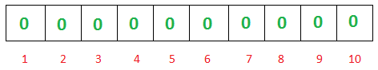
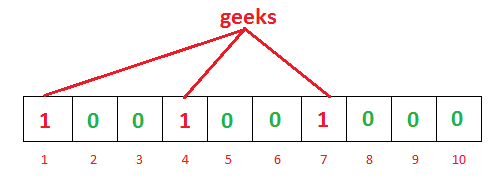
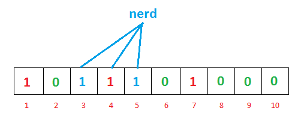
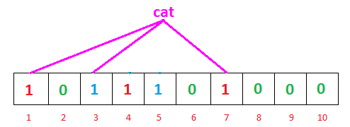
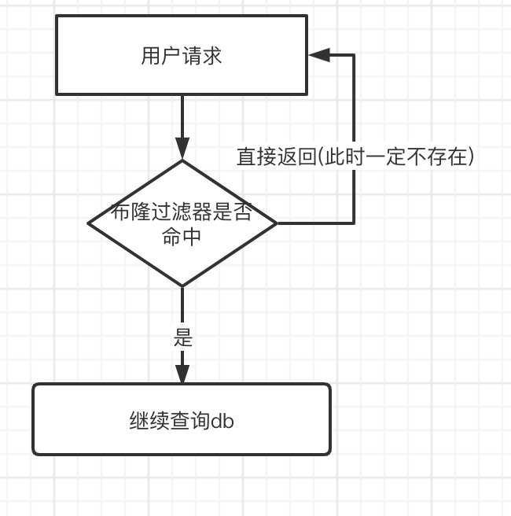

[TOC]

# 布隆过滤器


​		Bloom Filter是一种空间效率很高的随机数据结构，它利用位数组很简洁地表示一个集合，并能判断一个元素是否属于这个集合。Bloom Filter的这种高效是有一定代价的：在判断一个元素是否属于某个集合时，有可能会把不属于这个集合的元素误认为属于这个集合（false positive）。因此，Bloom Filter不适合那些“零错误”的应用场合。而在能容忍低错误率的应用场合下，Bloom Filter通过极少的错误换取了存储空间的极大节省。它实际上是`由一个很长的bit数组和一系列哈希函数组成的`。布隆过滤器可以用于检索一个元素是否在一个集合中。

​		leveldb 中利用布隆过滤器判断指定的 key 值是否存在于 sstable 中，若过滤器表示不存在，则该 key 一定不存在，由此加快了查找的效率。


## 结构

​		bloom 过滤器底层是一个<u>位</u>数组，初始时每一位都是 0


​		<u>**当插入值 x 后，分别利用 k 个哈希函数（图中为3）利用 x 的值进行散列，并将散列得到的值与 bloom 过滤器的容量进行取余，将取余结果所代表的那一位值置为 1 。**</u>


​		一次查找过程与一次插入过程类似，同样利用 k 个哈希函数对所需要查找的值进行散列，只有散列得到的每一个位的值均为 1，才表示该值 “  **有可能 **” 真正存在；反之若有任意一位的值为 0，则表示该值一定不存在。例如y1 一定不存在；而 y2 可能存在。


​		**<u>判断某个数是否在布隆过滤器中，就对该元素进行 k 次哈希计算，得到的值在位数组中判断每个元素是否都为 1，如果每个元素都为 1，就说明这个值在布隆过滤器中。</u>**


## 数学结论

​		http://blog.csdn.net/jiaomeng/article/details/1495500 该文中从数学的角度阐述了布隆过滤器的原理，以及一系列的数学结论。

首先，与布隆过滤器准确率有关的参数有：

- 哈希函数的个数 k；
- 布隆过滤器位数组的容量 m;
- 布隆过滤器插入的数据数量 n;

主要的数学结论有：

1. 为了获得最优的准确率，当 k = ln2 * (m/n) 时，布隆过滤器获得最优的准确性；
2. 在哈希函数的个数取到最优时，要让错误率不超过 є，m 至少需要取到最小值的 1.44 倍；


### **False positives 概率** 

#### 误差率 

​		布隆过滤器的误差率是指由于hash冲突，导致原本不再布隆过滤器中的数据，查询时显示在里面。 

- 初始化 



- 插入 geeks 单词 

  

- 插入 nerd 



- 查询 cat 



发现 1，3，7 号位均为 1，此时需要去后台数查询


## 实现

leveldb 中的布隆过滤器实现较为简单，有关的代码在 util/blomm.cc 中。
$$
\frac{m}{n} * \ln2 
	\approx
    0.7 * \frac{m}{n}
$$
​			

```cpp
class BloomFilterPolicy final : public FilterPolicy {
 public:
  explicit BloomFilterPolicy(int bits_per_key) : bits_per_key_(bits_per_key) {
    // We intentionally round down to reduce probing cost a little bit
    k_ = static_cast<size_t>(bits_per_key * 0.69);  // 0.69 =~ ln(2)
    if (k_ < 1) k_ = 1;
    if (k_ > 30) k_ = 30;
  }

  const char* Name() const override { return "BloomFilter2"; }

  void CreateFilter(const std::string* keys, int n,
                    std::string* dst) override {
    // Compute bloom filter size (in both bits and bytes)
    size_t bits = n * bits_per_key_;

    // For small n, we can see a very high false positive rate.  Fix it
    // by enforcing a minimum bloom filter length.
    if (bits < 64) bits = 64;

    size_t bytes = (bits + 7) / 8;
    bits = bytes * 8;

    const size_t init_size = dst->size();
    dst->resize(init_size + bytes, 0);
    dst->push_back(static_cast<char>(k_));  // Remember # of probes in filter
    char* array = &(*dst)[init_size];
    for (int i = 0; i < n; i++) {
      //BloomFilter理论是通过多个hash计算来减少冲突，
      //double-hashing的方式来达到同样的效果。
      //double-hashing的理论如下：
      //1、计算hash值；
      //2、hash值的高15位，低17位对调
      //3、按k_个数来存储当前hash值。
      //3-1、计算存储位置；
      //3-2、按bit存；
      //3-3、累加hash值用于下次计算 
      // Use double-hashing to generate a sequence of hash values.
      // See analysis in [Kirsch,Mitzenmacher 2006].
      uint32_t h = hash_func_.MurMurHash2(keys[i].c_str(), keys[i].size());
      const uint32_t delta = (h >> 17) | (h << 15);  // Rotate right 17 bits
      for (size_t j = 0; j < k_; j++) {
        const uint32_t bitpos = h % bits;
        array[bitpos / 8] |= (1 << (bitpos % 8));
        h += delta;
      }
    }
  }

  bool KeyMayMatch(const std::string& key,
                   const std::string& bloom_filter) override {
    const size_t len = bloom_filter.size();
    if (len < 2) return false;

    const char* array = bloom_filter.data();
    const size_t bits = (len - 1) * 8;

    // Use the encoded k so that we can read filters generated by
    // bloom filters created using different parameters.
    const size_t k = array[len - 1];
    if (k > 30) {
      // Reserved for potentially new encodings for short bloom filters.
      // Consider it a match.
      return true;
    }
    
    uint32_t h = hash_func_.MurMurHash2(key.c_str(), key.size());
    const uint32_t delta = (h >> 17) | (h << 15);  // Rotate right 17 bits
    for (size_t j = 0; j < k; j++) {
      const uint32_t bitpos = h % bits;
      if ((array[bitpos / 8] & (1 << (bitpos % 8))) == 0) return false;
      h += delta;
    }
    return true;
  }
  // Return a new filter policy that uses a bloom filter with approximately
  // the specified number of bits per key.  A good value for bits_per_key
  // is 10, which yields a filter with ~ 1% false positive rate.
 private:
  size_t bits_per_key_;
  size_t k_;
  HashFunc hash_func_;
};
}  // namespace hard_core
```


## 布隆过滤器使用场景 

1. 黑名单校验 
2. 快速去重 
3. 爬虫 URL 校验 
4. leveldb/rocksdb 快速判断数据是否已经 block 中，避免频繁访问磁盘 
5. 解决缓存穿透问题


### 缓存穿透 

1. 概念 

   ​		缓存穿透是指查询一个数据库中不一定存在的数据；正常流程是依据 key 去查询 value，数据查询先进行缓存查询，如果 key 不存在或者 key 已经过期，再对数据库进行查询，并把查询到的对象，放进缓存。如果数据库查询对象为空，则不放进缓存。 

   ​		如果每次都查询一个不存在 value 的 key，由于缓存中没有数据，所以每次都会去查询数据库，对 db 造成很大的压力。 

2. 解决方案 

   - 缓存空值 

     将数据库中的空值也缓存到缓存层中，这样查询该空值就不会再访问DB，而是直接在缓存层访问就行。 

     - 缺点：空值过期时间不太好确定 

   - 使用布隆过滤器 
     - 原理 



- 构建方法 
  - 使用 redis 的 module 加载外部 so 文件 
    - 优点：操作简单 
    - 缺点： 
      - 需要高版本的 redis 
      - 容易形成大 key 
  - 借助 bitmap 来实现，k 个 hash 函数，创建 n 个 bitmap (推荐) 
    - 优点：操作简单 
    - 缺点： 
      - 由于 redis 的字符串要求最大为 512M，所以需要拆分多个 key 
      - 扩容稍微复杂 
  - 可以自己本地来实现布隆过滤器的计算，计算完之后在存入 redis 
    - 优点：自己操作更灵活 
    - 缺点： 
      - 流程复杂 
      - 需要额外服务重启或当机之后布隆过滤器丢失问题 

### 优点 

1. 节省内存空间 
2. 插入和查询时间复杂度都为O(1) 

### 缺点 

1. 布隆过滤器不支持删除 
2. 由于哈希冲突的原因，可能会出现假阳性


### 思考 

- 布隆过滤器多适用于数据更新较少的场景，如果海量数据模式下，数据量又频繁变化，如何高效构建布隆过滤器呢？ 
  - 使用 mapreduce 来并行执行 
- 布隆过滤器如何支持删除操作呢？ 
  - 计数布隆过滤器 
  - 布谷鸟过滤器 


