[TOC]


# 基础组件

## 一、Slice

Leveldb 中代替 string 的基本数据结构：

1. 包括 length 和一个指向外部字节数组的指针。
2. 和 string 一样，允许字符串中包含 ’\0’。

​        提供一些基本接口，可以把 const char 和 string 转换为 Slice；把 Slice 转换 为string，取得数据指针 const char。


## 二、satus

​		Leveldb 中的**返回状态**，将错误号和错误信息封装成 Status 类，统一进行处理。并定义了几种具体的返回状态，如成功或者文件不存在等。

​		为了节省空间 Status 并没有用 std::string 来**存储错误信息**，而是将返回码(code), 错误信息 message 及长度打包存储于一个字符串数组中。

成功状态OK 是 NULL state_ ，否则 state_ 是一个包含如下信息的数组:

```
state_[0..3] == 消息 message 长度 
state_[4]    == 消息 code
state_[5..]  == 消息 message 
```

其基本组成：

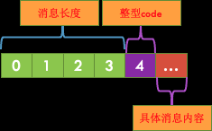


## 三、Arena

​		leveldb 的简单的内存池，它所作的工作十分简单，申请内存时，将申请到的内存块放入 std::vector blocks_中，在 Arena 的生命周期结束后，统一释放掉所有申请到的内存，内部结构如下图所示。

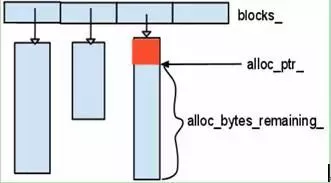


​		**Arena主要提供了两个申请函数**：其中一个直接分配内存，另一个可以申请对齐的内存空间。

​		<u>Arena 没有直接调用 delete/free 函数</u>，而是由 Arena 的析构函数统一释放所有的内存。应该说这是和 leveldb 特定的应用场景相关的，比如一个 memtable 使用一个Arena，当 memtable 被释放时，<u>由 Arena 统一释放其内存。</u>

Allocate 函数：

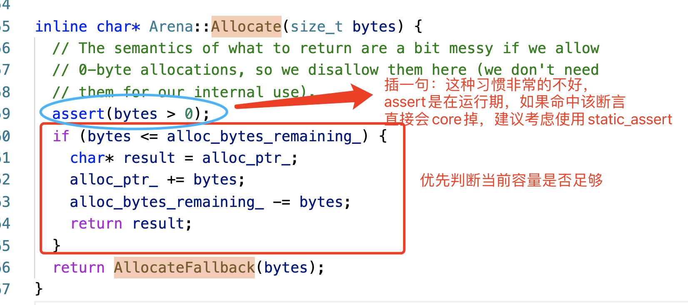


AllocateFallback：

 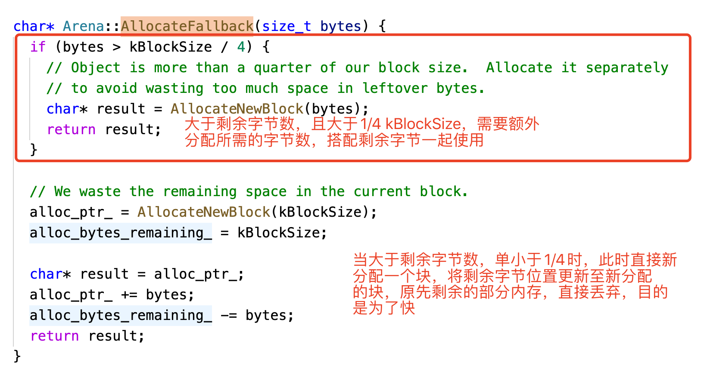

AllocateAligned

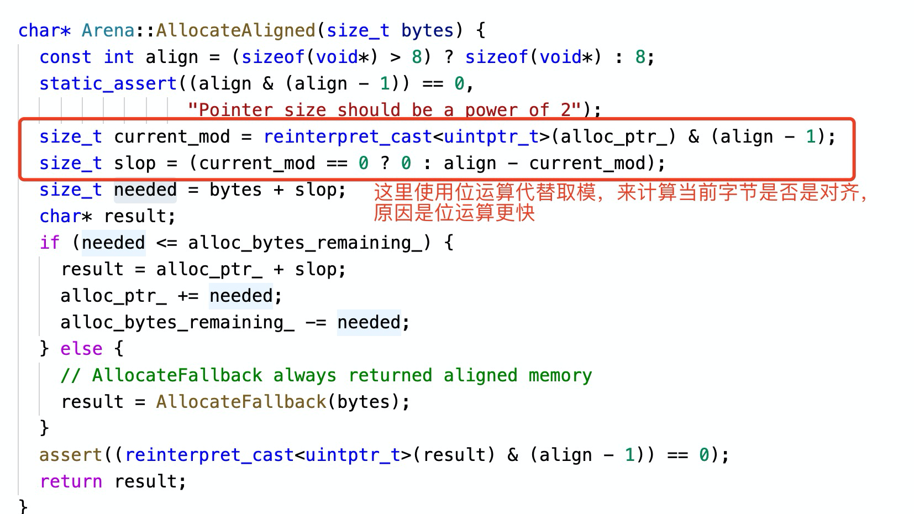


## 四、各种 Key 与 Compare

各类的 key ：

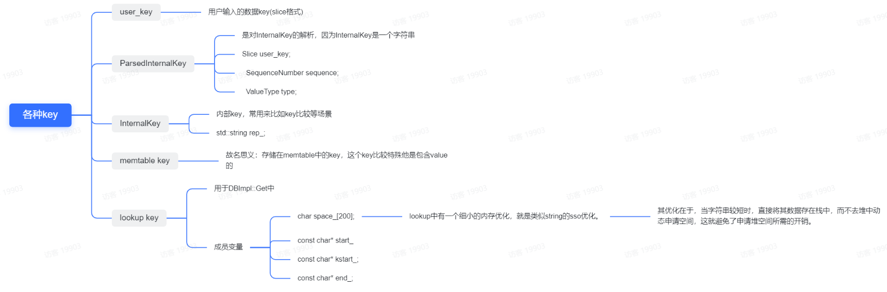


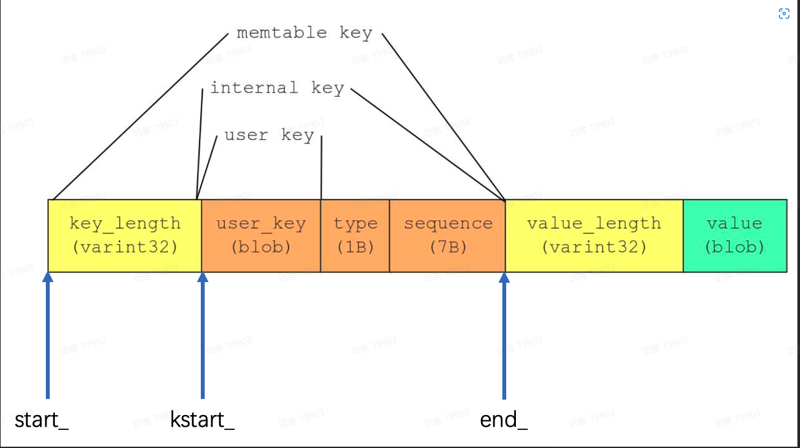


InternalKey 转 ParsedInternalKey： 

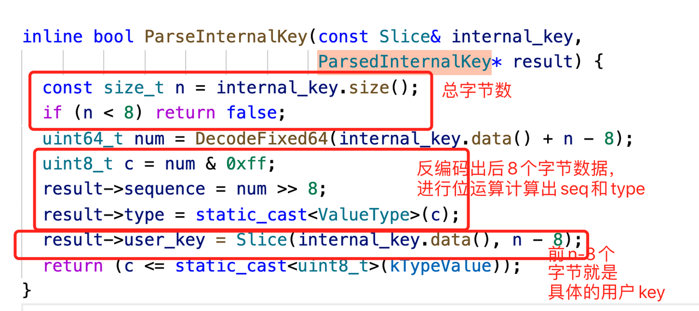

lookup 内部各种 key 转换 

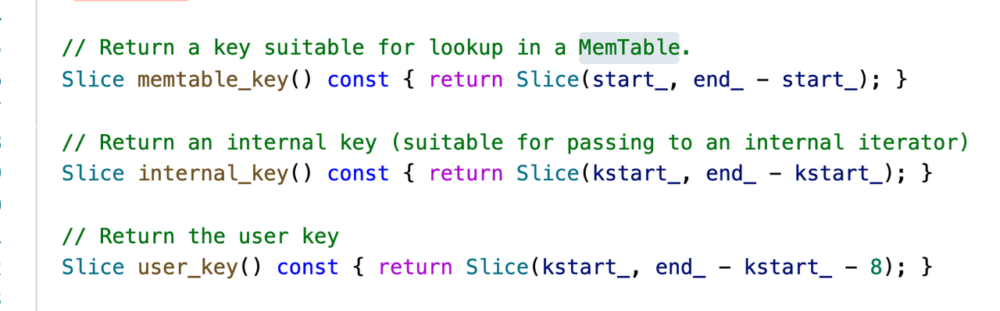

### 各类 compare 

​		在  leveldb 中，无论是插入还是删除，key 之间的比较是不可避免的，于是乎，抽象出了一个基类Comparator。

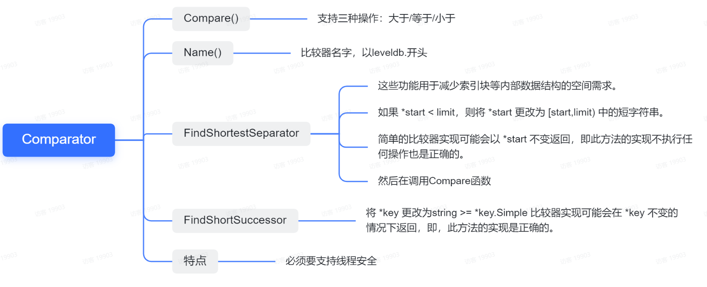

目前已经实现的有两类 BytewiseComparatorImpl 和 InternalKeyComparator。 

- InternalKeyComparator：内部调用的也是 BytewiseComparatorImpl 
- BytewiseComparatorImpl

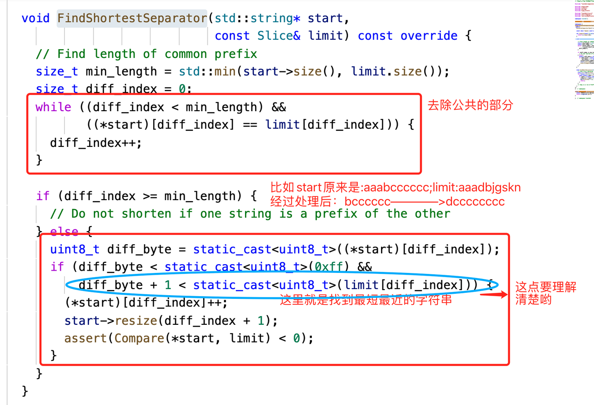


## 五、WriteBatch

WriteBatch 使用批量写来提高性能，支持 put 和 delete。

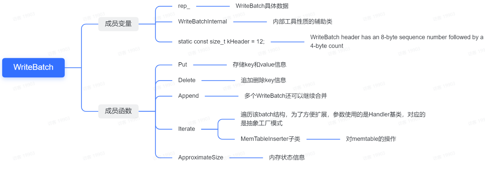

基本组成：

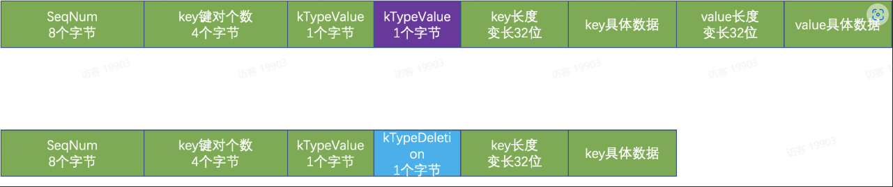


## 六、编码 

​		leveldb 中分为定长和变长编码，其中变长编码目的是为了减少空间占用。其基本思想是：每一个 Byte 最高位 bit 用 0/1 表示该整数是否结束，用剩余 7bit 表示实际的数值，在 protobuf 中被广泛使用。 

见函数`char* EncodeVarint32(char* dst, uint32_t v)`

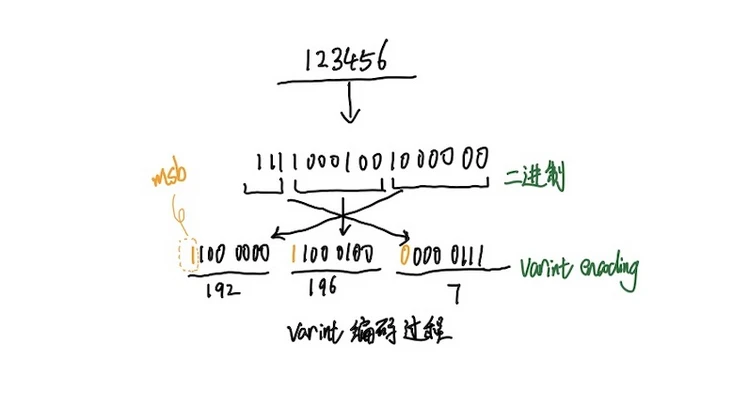


