[TOC]

# Env

leveldb 是跨平台的，因此 Env 封装了跨平台的内容，其成员函数如下

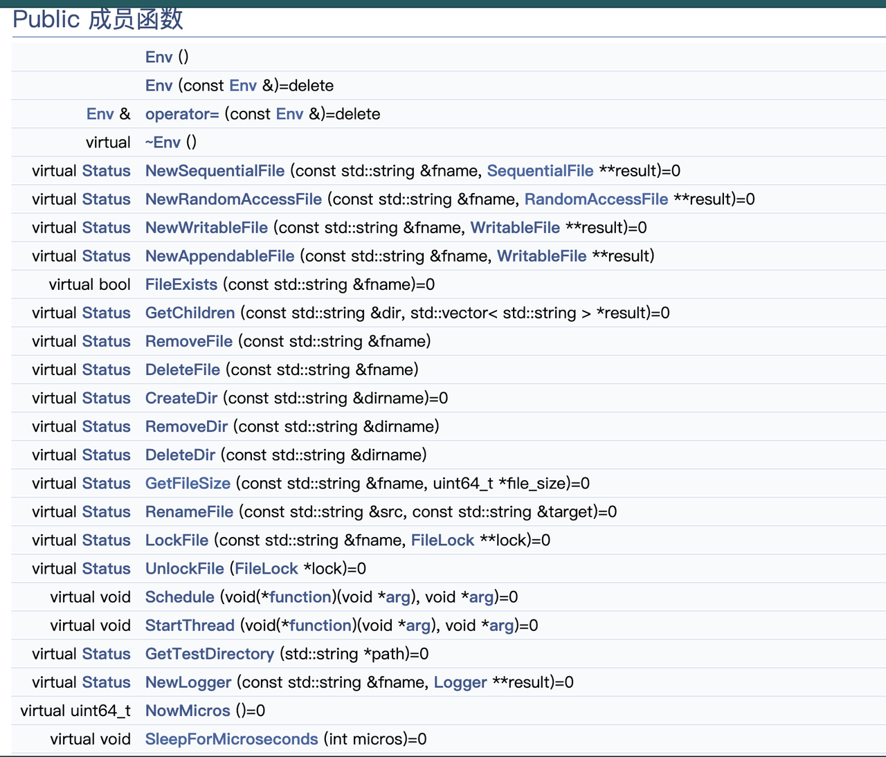

​		注意，New 开头的成员函数，其 Status 表示函数执行状态，而实际生成的对象是在函数的第二个参数，现代C++ 一般不建议这样操作。

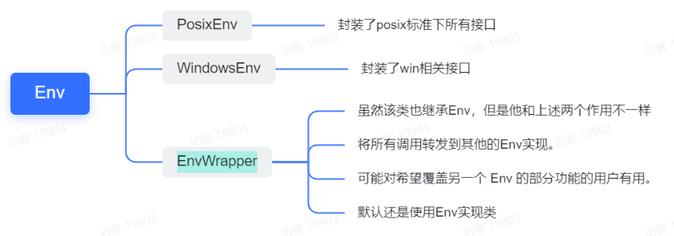

默认实现： 

```c++
using PosixDefaultEnv = SingletonEnv<PosixEnv>; 
```

​		需要特别注意的是该 PosixDefaultEnv 是个单例模式，在这里稍微扩展一下，他的实现方式使用了std::aligned_storage 来指定对象的对齐方式。具体含义见下文的链接

[std::aligned_storage - C++中文 - API参考文档](https://www.apiref.com/cpp-zh/cpp/types/aligned_storage.html)


### EnvWrapper 

​		上文说到，EnvWrapper 可以理解成对 Env 的扩展，本质其实是使用了代理设计模式。

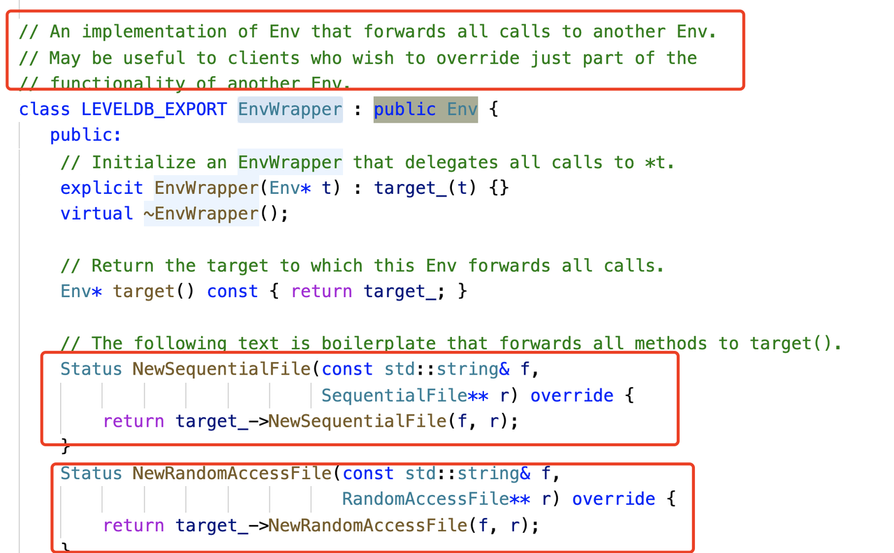

我们可以来看看其中一个子类的实现**InMemoryEnv**

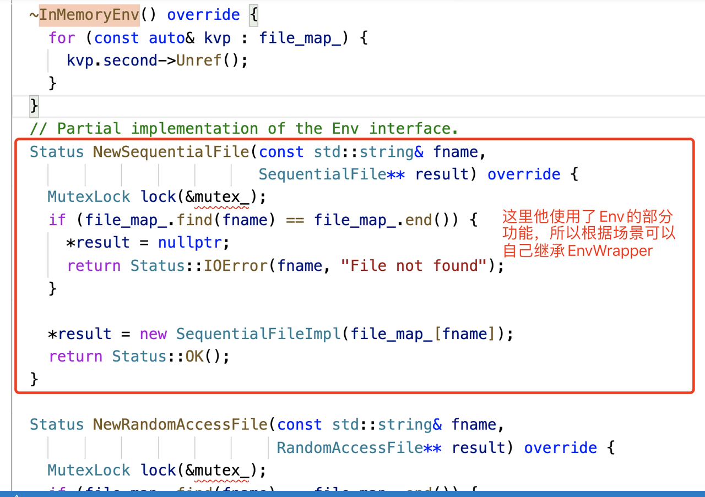


### WritableFile&PosixWritableFile 

​		用于顺序写入的文件抽象。 实现必须提供缓冲，因为调用者可能一次将小数据量数据追加到文件中。WritableFile 是纯虚函数。

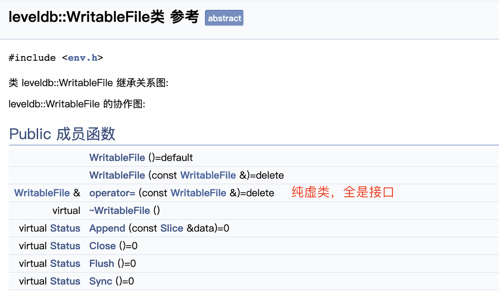


来看看他的工作原理，其中尽可能的 copy 到 buffer 就返回，因为 WriteUnbuffered 是一个同步操作。

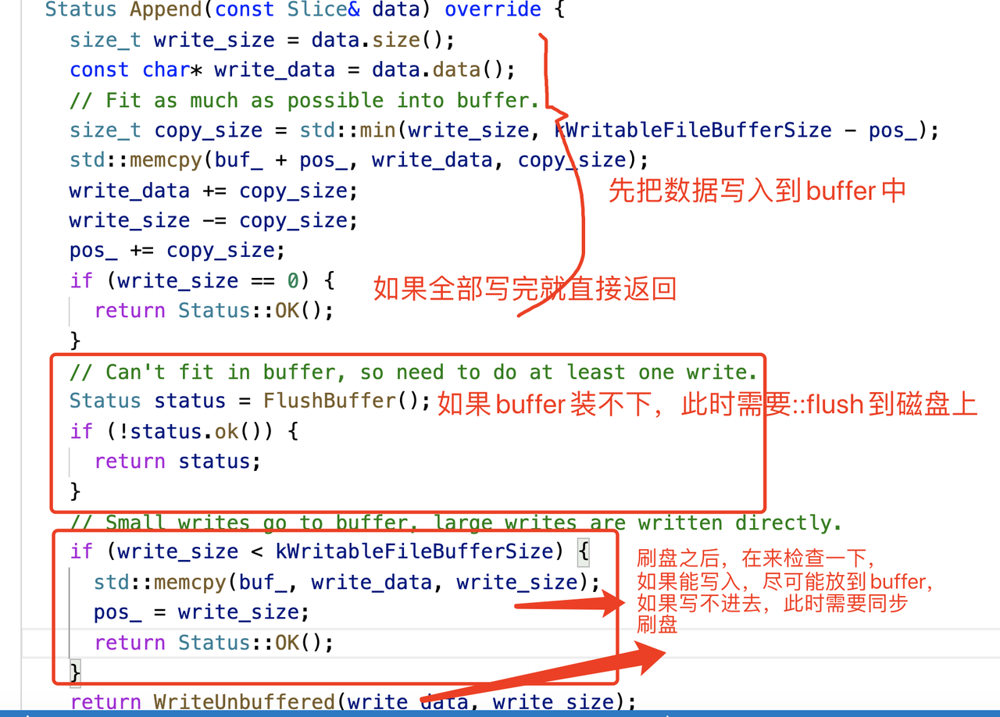


### RandomAccessFile&PosixRandomAccessFile/PosixMmapReadableFile

#### 资源限制类 Limiter 

1. Helper 类限制资源使用，避免耗尽。目前用于限制只读文件描述符和 mmap 文件使用，这样我们就不会用完文件描述符或虚拟内存，或者遇到非常大的数据库的内核性能问题。 
2. 使用 atomic 原子变量，所以线程安全


#### RandomAccessFile 

RandomAccessFile 用于随机读取文件内容的文件抽象。线程安全。


#### *PosixMmapReadableFile 

leveldb 中使用 mmap 共享内存来提高性能。 

1. mmap() 函数可以把一个文件或者 Posix 共享内存对象映射到调用进程的地址空间。映射分为两种。 

   - 文件映射：文件映射将一个文件的一部分直接映射到调用进程的虚拟内存中。一旦一个文件被映射之后就可以通过在相应的内存区域中操作字节来访问文件内容了。映射的分页会在需要的时候从文件中（自动）加载。这种映射也被称为基于文件的映射或内存映射文件。 
     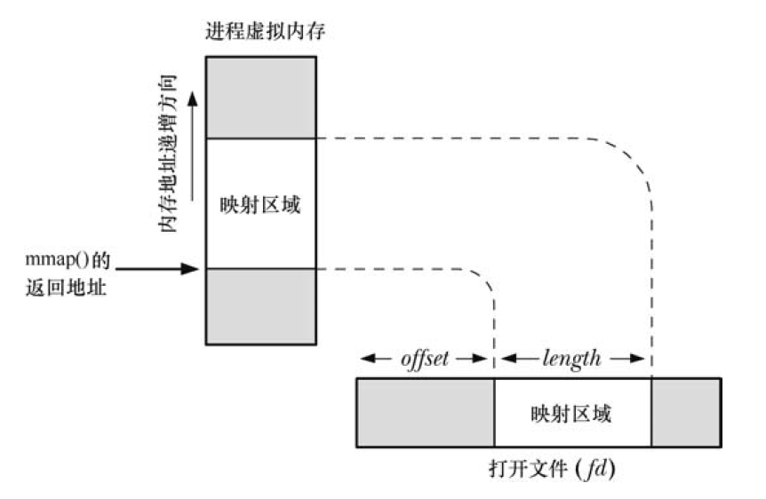

   - 匿名映射：一个匿名映射没有对应的文件。相反，这种映射的分页会被初始化为 0。 

2. mmap()系统调用在调用进程的虚拟地址空间中创建一个新映射。 

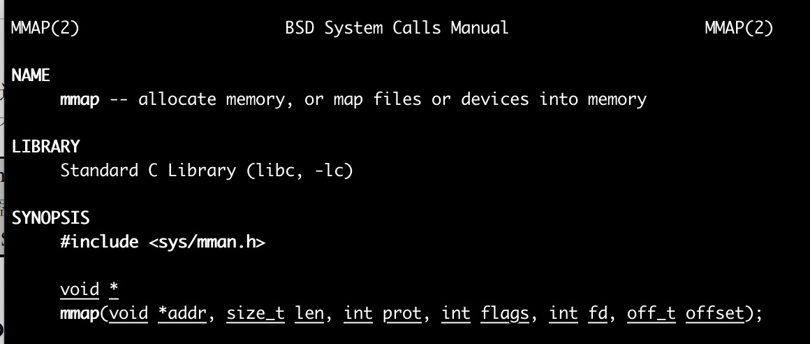

参数解析： 

返回值：若映射成功，返回被映射区的起始地址；否则返回MAP_FAILED【其值为(void *)-1】， 错误原因存于errno中，常见的值为：

- *EACCES：* 访问出错
- *EAGAIN：* 文件已被锁定，或者太多的内存已被锁定
- *EBADF：* fd不是有效的文件描述词
- *EINVAL：* 一个或者多个参数无效
- *ENFILE：* 已达到系统对打开文件的限制
- *ENODEV：* 指定文件所在的文件系统不支持内存映射
- *ENOMEM：* 内存不足，或者进程已超出最大内存映射数量
- *EPERM：* 权能不足，操作不允许
- *ETXTBSY：* 已写的方式打开文件，同时指定MAP_DENYWRITE标志
- *SIGSEGV：* 试着向只读区写入
- *SIGBUS：* 试着访问不属于进程的内存区

addrs:  映射内存的启示地址，可以指定，也可以设置为 NULL，设置为 NULL 时，内核会自己寻找一块内存 

len：表示映射到进程地址空间的字节数，它从被影射文件开头起第 offset 个字节处开始算，offset 通常设置成 0 

prot：共享内存的保护参数，具体见下表 

| prot取值   | 功能说明     |
| ---------- | ------------ |
| PROT_READ  | 可读         |
| PROT_WRITE | 可写         |
| PROT_EXEC  | 可执行       |
| PROT_NONE  | 数据不可访问 |

flags：控制映射操作各个方面的选项的位掩码。这个掩码必须只包含下列值中一个。 

| flags                  | 功能说明                                                     |
| ---------------------- | ------------------------------------------------------------ |
| MAP_SHARED             | 变动是共享的                                                 |
| MAP_PRIVATE            | 变动是私有的，意思是只在本进程有效，这就意味着会触发 cow 机制 |
| MAP_FIXED              | 不允许系统选择与指定地址不同的地址。 如果无法使用指定的地址， mmap() 将失败。 如果指定了 MAP_FIXED，则 addr 必须是页面大小的倍数。 如果 MAP_FIXED 请求成功，则 mmap() 建立的映射将替换从 addr 到 addr + len 范围内进程页面的任何先前映射。不鼓励使用此选项。 |
| MAP_NOCACHE            | 此映射中的页面不会保留在内核的内存缓存中。 如果系统内存不足，MAP_NOCACHE 映射中的页面将首先被回收。 该标志用于几乎没有局部性的映射，并为内核提供一个提示，即在不久的将来不太可能再次需要该映射中的页面。 |
| MAP_HASSEMAPHORE       | 通知内核该区域可能包含信号量并且可能需要特殊处理。           |
| MAP_ANONYMOUS/MAP_ANON | 该内存不是从文件映射而来，其内容会被全部初始化为0，而且mmap最后的两个参数会被忽略 |

fd：对应被打开的文件套接字，一般是通过open系统调用。mmap返回后，该fd可以close掉 

offset：文件起始位置 

3. munmap()系统调用执行与mmap()相反的操作，即从调用进程的虚拟地址空间中删除映射。 

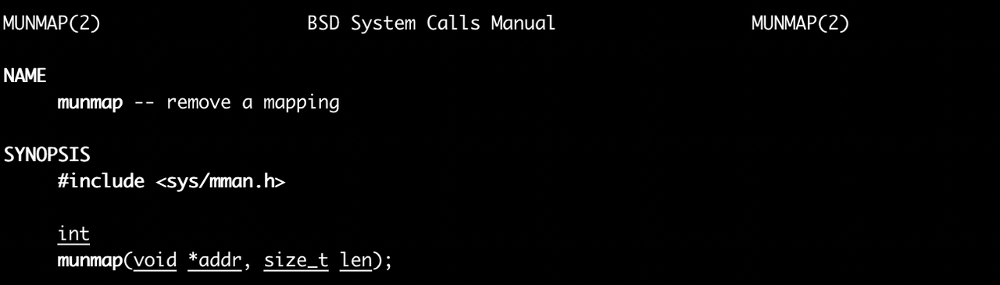

4. msync: 用于刷盘策略。内核的虚拟内存算法保持内存映射文件与内存映射区的同步，因此内核会在未来某个时刻同步，如果我们需要实时，则需要 msync 同步刷。 

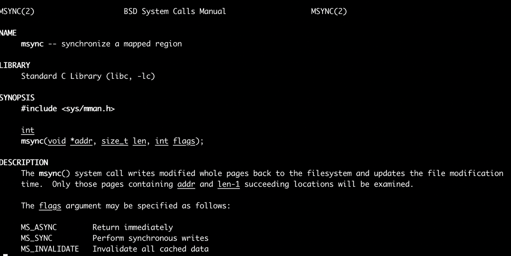

5. 需要特别注意两个信号：SIGBUG 和 SIGSEGV 

- SIGBUG：表示我们在内存范围内访问，但是超出了底层对象的大小 
- SIGSEGV：表示我们已经在内存映射范围外访问了。(**私底下测试，不是很经常浮现，但是我们实际生产者遇到过，注意踩坑**) 

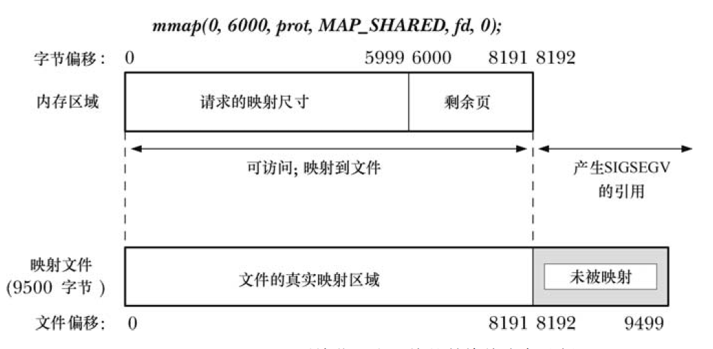

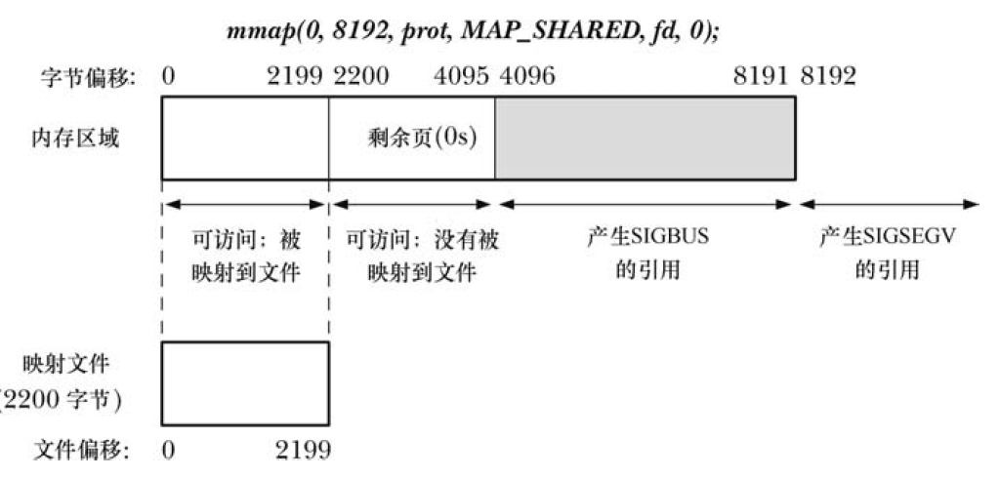


### SequentialFile 

顺序读取的抽象

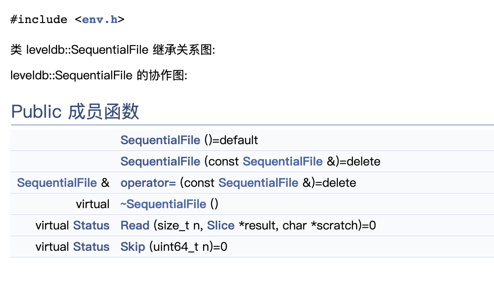


### FileLock 

​		FileLock 该类实质上没干什么真正的事情，主要是 window 和 linux上 对句柄的抽象不太一样，所以做了一个基类来进行接口的设计。 

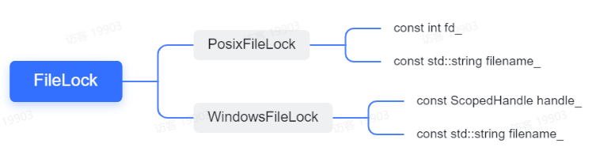


#### PosixFileLock 

​		这里需要使用文件锁，因此涉及到文件的 fd 和所选的文件名，为了方便操作，于是乎将两者打包成一个对象。

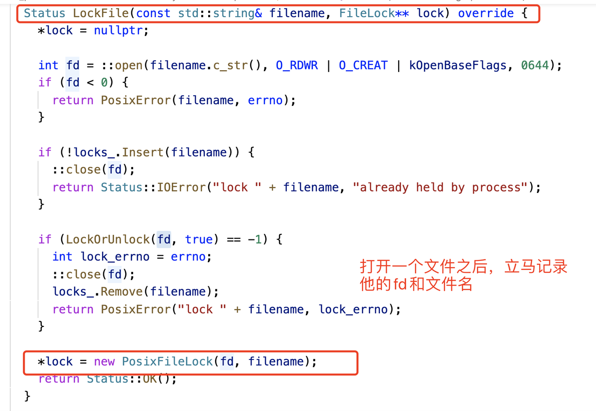

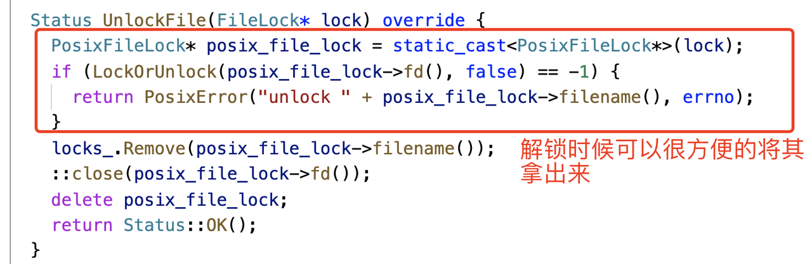

#### PosixLockTable 

​		我们维护一个单独的集合，而不是依赖 fcntl(F_SETLK)，因为 fcntl(F_SETLK) 不提供任何针对同一进程多次使用的保护。也就是说单个进程可以重复拿到锁，但是这个对业务来说是不正确的

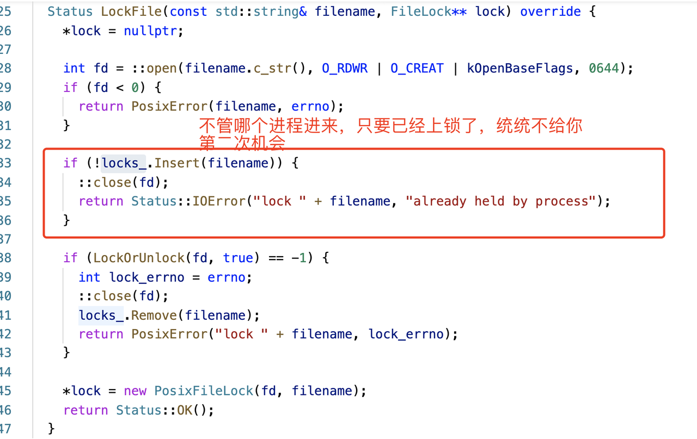

#### 文件锁 

因为我们锁定整个文件，所以直接使用 flock 即可

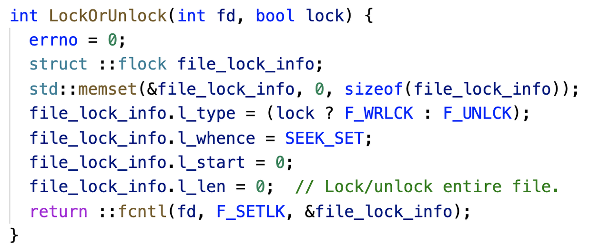

