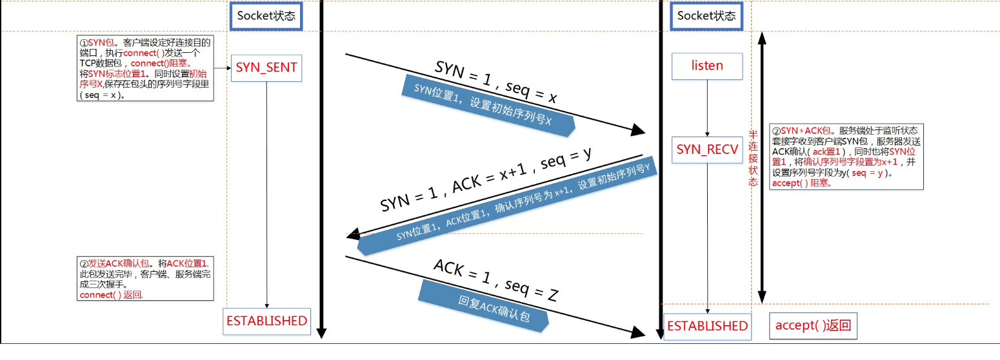

[TOC]

# socket


## 一、接口介绍

### 1、socket 函数

​		socket() 函数的原型如下，这个函数建立一个协议族为 domain、协议类型为type、协议编号为 protocol 的套接字文件描述符。如果函数调用成功，会返回一个标识这个套接字的文件描述符，失败的时候返回-1。

```c++
#include <sys/types.h>          /* See NOTES */
#include <sys/socket.h>

int socket(int domain/* 协议族 */
           , int type/* 协议类型 */
           , int protocol/* 协议编号 */);
```

* domain  
  函数 socket() 的参数 domain 用于设置网络通信的域，函数 socket() 根据这个参数选择通信协议的族。通信协议族在文件 sys/socket.h 中定义。  

| 名称             | 含义              | 名称         | 含义                     |
| ---------------- | ----------------- | ------------ | ------------------------ |
| PF_UNIX PF_LOCAL | 本地通信          | PF_X25       | ITU-T X25 / ISO-8208协议 |
| AF_INET,PF_INET  | IPv4 Internet协议 | PF_AX25      | Amateur radio AX.25      |
| PF_INET6         | IPv6 Internet协议 | PF_ATMPVC    | 原始ATM PVC访问          |
| PF_IPX           | IPX-Novell协议    | PF_APPLETALK | Appletalk                |
| PF_NETLINK       | 内核用户界面设备  | PF_PACKET    | 底层包访问               |

* type
  函数 socket() 的参数 type 用于设置套接字通信的类型，主要有SOCKET_STREAM（流式套接字）、SOCK——DGRAM（数据包套接字）等。

| 名称           | 含义                                                         |
| -------------- | ------------------------------------------------------------ |
| SOCK_STREAM    | Tcp连接，提供序列化的、可靠的、双向连接的字节流。支持带外数据传输 |
| SOCK_DGRAM     | 支持UDP连接（无连接状态的消息）                              |
| SOCK_SEQPACKET | 序列化包，提供一个序列化的、可靠的、双向的基本连接的数据传输通道，数据长度定常。每次调用读系统调用时数据需要将全部数据读出 |
| SOCK_RAW       | RAW类型，提供原始网络协议访问                                |
| SOCK_RDM       | 提供可靠的数据报文，不过可能数据会有乱序                     |

并不是所有的协议族都实现了这些协议类型，例如，AF_INET协议族就没有实现SOCK_SEQPACKET协议类型。

* protocol
  函数 socket() 的第 3 个参数 protocol 用于制定某个协议的特定类型，即type类型中的某个类型。通常某协议中只有一种特定类型，这样 protocol参数仅能设置为0 ；但是有些协议有多种特定的类型，就需要设置这个参数来选择特定的类型。

* errno
  函数 socket() 并不总是执行成功，有可能会出现错误，错误的产生有多种原因，可以通过 errno 获得：

| 值              | 含义                                             |
| --------------- | ------------------------------------------------ |
| EACCES          | 没有权限建立制定的domain的type的socket           |
| EAFNOSUPPORT    | 不支持所给的地址类型                             |
| EINVAL          | 不支持此协议或者协议不可用                       |
| EMFILE          | 进程文件表溢出                                   |
| ENFILE          | 已经达到系统允许打开的文件数量，打开文件过多     |
| ENOBUFS/ENOMEM  | 内存不足。socket只有到资源足够或者有进程释放内存 |
| EPROTONOSUPPORT | 制定的协议type在domain中不存在                   |

比如我们建立一个流式套接字可以这样：

```c++
int sock = socket(AF_INET, SOCK_STREAM, 0);
```

### 2、bind 函数

&emsp;&emsp;在套接口中，一个套接字只是用户程序与内核交互信息的枢纽，它自身没有太多的信息，也没有网络协议地址和 端口号等信息，在进行网络通信的时候，必须把一个套接字与一个地址相关联，这个过程就是地址绑定的过程。许多时候内核会我们自动绑定一个地址，然而有时用 户可能需要自己来完成这个绑定的过程，以满足实际应用的需要，最典型的情况是一个服务器进程需要绑定一个众所周知的地址或端口以等待客户来连接。这个事由 bind 的函数完成。

```cpp
int bind( int sockfd, struct sockaddr* addr, socklen_t addrlen)
```

* sockfd
  socket 函数返回的句柄或者称文件描述符。
* addr
  addr 是指向一个结构为 sockaddr 参数的指针，sockaddr 中包含了地址、端口和 IP 地址的信息。在进行地址绑定的时候，需要先将地址结构中的IP 地址、端口、类型等结构 struct sockaddr 中的域进行设置之后才能进行绑定，这样进行绑定后才能将套接字文件描述符与地址等接合在一起。  
  由于历史原因，我们前后有两个地址结构：
  **struct sockaddr**
  该结构定义如下：

```cpp
struct sockaddr { 
	uint8_t sa_len;　　 
	unsigned short sa_family; /* 地址家族, AF_xxx */ 　　 
	char sa_data[14]; /*14字节协议地址*/ 　　
};
```

​		其实这个结构逐渐被舍弃，但是也还是因为历史原因，在很多的函数，比如connect、bind 等还是用这个作为声明，实际上现在用的是第二个结构，我们需要把第二个结构强转成 sockaddr。
**struct sockaddr_in**
其定义如下：

```c++
struct sockaddr_in { 
　　 uint8_t sa_len;   /* 结构体长度*/ 
    short int sin_family; /* 通信类型 */ 
　　 unsigned short int sin_port; /* 端口 */ 
　　 struct in_addr sin_addr; /* Internet 地址 */ 
　　 unsigned char sin_zero[8]; /* 未使用的*/ 
　　 };

struct in_addr {   //sin_addr的结构体类型in_addr 原型
　　 unsigned long s_addr; /*存4字节的 IP 地址(使用网络字节顺序)。*/
　　 };
```

​		在使用的时候我们必须指定通信类型，也必须把端口号和地址转换成网络序的字节序。

* addrlen
  addr 结构的长度，可以设置成 sizeof(struct sockaddr)。使用 sizeof(struct sockaddr) 来设置套接字的类型和其对已ing的结构。 

​		bind() 函数的返回值为 0 时表示绑定成功，-1 表示绑定失败，errno 的错误值如表1所示。

| 值            | 含义                                     | 备注                |
| ------------- | ---------------------------------------- | ------------------- |
| EADDRINUSE    | 给定地址已经使用                         |                     |
| EBADF         | sockfd 不合法                            |                     |
| EINVAL        | sockfd 已经绑定到其他地址                |                     |
| ENOTSOCK      | sockfd是一个文件描述符，不是socket描述符 |                     |
| EACCES        | 地址被保护，用户的权限不足               |                     |
| EADDRNOTAVAIL | 接口不存在或者绑定地址不是本地           | UNIX协议族，AF_UNIX |
| EFAULT        | my_addr指针超出用户空间                  | UNIX协议族，AF_UNIX |
| EINVAL        | 地址长度错误，或者socket不是AF_UNIX族    | UNIX协议族，AF_UNIX |
| ELOOP         | 解析my_addr时符号链接过多                | UNIX协议族，AF_UNIX |
| ENAMETOOLONG  | my_addr过长                              | UNIX协议族，AF_UNIX |
| ENOENT        | 文件不存在                               | UNIX协议族，AF_UNIX |
| ENOMEN        | 内存内核不足                             | UNIX协议族，AF_UNIX |
| ENOTDIR       | 不是目录                                 | UNIX协议族，AF_UNIX |

比如这样：

```c++
    struct sockaddr_in addr;
    memset(&addr, 0, sizeof(struct sockaddr_in));

    addr.sin_family = AF_INET;
    addr.sin_port = htons(port);
    addr.sin_addr.s_addr = INADDR_ANY;
    
    if (bind(sfd, (struct sockaddr*)&addr, sizeof(struct sockaddr_in)) < 0) 
    {
	    perror("bind");
	    exit(1);
    }
```

### 3、listen 函数

```c++
int listen(int sockfd, int backlog);
```

​		listen() 函数将 sockfd 标记为被动打开的套接字，并作为 accept 的参数用来接收到达的连接请求。

* sockfd 是一个套接字类型的文件描述符，具体类型为 SOCK_STREAM 或者 SOCK_SEQPACKET。

* backlog 参数用来描述 sockfd 的等待连接队列能够达到的最大值。当一个请求到达并且该队列为满时，客户端可能会收到一个表示连接失败的错误，或者如果底层协议支持重传(比如 tcp 协议),本次请求会被丢弃不作处理，在下次重试时期望能连接成功(下次重传的时候队列可能已经腾出空间)。 

* errno

| 值         | 含义                                       |
| ---------- | ------------------------------------------ |
| EADDRINUSE | 另一个套接字已经绑定在相同的端口上。       |
| EBADF      | 参数sockfd不是有效的文件描述符。           |
| ENOTSOCK   | 参数sockfd不是套接字。                     |
| EOPNOTSUPP | 参数sockfd不是支持listen操作的套接字类型。 |

### 4、connect 函数 

**声明如下**

```
int connect(int sockfd, const struct sockaddr *addr, socklen_t addrlen);
```

**参数说明如下**

* sockfd 是系统调用 socket() 返回的套接字文件描述符。
* serv_addr 是 保存着目的地端口和 IP 地址的数据结构 struct sockaddr_in。
* addrlen 设置 为 sizeof(struct sockaddr_in)

**errno**
connect函数在调用失败的时候返回值-1，并会设置全局错误变量 errno。

| 值           | 含义                                    |
| ------------ | --------------------------------------- |
| EBADF        | 参数sockfd 非合法socket处理代码         |
| EFAULT       | 参数serv_addr指针指向无法存取的内存空间 |
| ENOTSOCK     | 参数sockfd为一文件描述词，非socket。    |
| EISCONN      | 参数sockfd的socket已是连线状态          |
| ECONNREFUSED | 连线要求被server端拒绝。                |
| ETIMEDOUT    | 企图连线的操作超过限定时间仍未有响应。  |
| ENETUNREACH  | 无法传送数据包至指定的主机。            |
| EAFNOSUPPORT | sockaddr结构的sa_family不正确。         |

### 5、accept 函数 

**函数声明**

```c++
int accept(int sockfd, struct sockaddr *addr, socklen_t *addrlen);
```

**参数说明**
		sockfd 是由 socket 函数返回的套接字描述符，参数 addr 和 addrlen 用来返回已连接的对端进程（客户端）的协议地址。如果我们对客户端的协议地址不感兴趣，可以把 arrd 和 addrlen 均置为空指针。

**返回值**

​		成功时，返回非负整数，该整数是接收到套接字的描述符；出错时，返回－1，相应地设定全局变量 errno。

| 值         | 含义                                 |
| ---------- | ------------------------------------ |
| EBADF      | 非法的 socket                        |
| EFAULT     | 参数 addr 指针指向无法存取的内存空间 |
| ENOTSOCK   | 参数 s 为一文件描述词，非 socket     |
| EOPNOTSUPP | 指定的socket并非SOCK_STREAM          |
| EPERM      | 防火墙拒绝此连线                     |
| ENOBUFS    | 系统的缓冲内存不足                   |
| ENOMEM     | 核心内存不足                         |

​		特别需要说明下的是，这个accept是一个阻塞式的函数，对于一个阻塞的套套接字，一直阻塞，或者返回一个错误值，对于非阻塞套接字。accept有可能返回-1，但是如果errno的值为，EAGAIN或者EWOULDBLOCK，此时需要重新调用一次accept函数。


### 6、send和recv函数

**函数申明如下**

```c++
ssize_t recv(int sockfd, void *buf, size_t len, int flags);
ssize_t send(int sockfd, const void *buf, size_t len, int flags);
```

* sockfd  ：套接字
* buf : 待发送或者接收的缓存
* len : 如果是recv指期望接收的长度，如果是send指要发送的长度。
* flags : 标志位，取值如下表：  

| flags         | 说明               | recv | send |
| ------------- | ------------------ | ---- | ---- |
| MSG_DONTROUTE | 绕过路由表查找     |      | •    |
| MSG_DONTWAIT  | 仅本操作非阻塞     | •    | •    |
| MSG_OOB       | 发送或接收带外数据 | •    | •    |
| MSG_PEEK      | 窥看外来消息       | •    |      |
| MSG_WAITALL   | 等待所有数据       | •    |      |

**errno**

| 值          | 含义                                                 |
| ----------- | ---------------------------------------------------- |
| EAGAIN      | 套接字已标记为非阻塞，而接收操作被阻塞或者接收超时   |
| EBADF       | sock不是有效的描述词                                 |
| ECONNREFUSE | 远程主机阻绝网络连接                                 |
| EFAULT      | 内存空间访问出错                                     |
| EINTR       | 操作被信号中断                                       |
| EINVAL      | 参数无效                                             |
| ENOMEM      | 内存不足                                             |
| ENOTCONN    | 与面向连接关联的套接字尚未被连接上                   |
| ENOTSOCK    | sock索引的不是套接字 当返回值是0时，为正常关闭连接； |

当返回值为-1时是不是一定就错误了。


## 二、TCP原理介绍

### TCP协议头解释

tcp协议头格式如下：


**详细解析**
16 位源端口号和 16 位目的端口号。
32 位序号：<u>一次 TCP 通信过程中某一个传输方向上的字节流的每个字节的编号，通过这个来确认发送的数据有序，比如现在序列号为 1000，发送了 1000，下一个序列号就是 2000。</u>
32 位确认号：用来响应 TCP 报文段，给收到的 TCP 报文段的序号加 1，三握时还要携带自己的序号。
4 位头部长度：标识该 TCP 头部有多少个 4 字节，共表示最长 15\*4 = 60 字节。同 IP 头部。
6 位保留。6 位标志。URG（紧急指针是否有效）ACK（表示确认号是否有效）PSH（提示接收端应用程序应该立即从TCP接收缓冲区读走数据）RST（表示要求对方重新建立连接）SYN（表示请求建立一个连接）FIN（表示通知对方本端要关闭连接）
16位窗口大小：TCP 流量控制的一个手段，用来告诉对端 TCP 缓冲区还能容纳多少字节。
16位校验和：由发送端填充，接收端对报文段执行CRC算法以检验TCP报文段在传输中是否损坏。
16位紧急指针：一个正的偏移量，它和序号段的值相加表示最后一个紧急数据的下一字节的序号。

### TCP建立连接的三次握手


为什么需要三次握手？

​		TCP 作为一种可靠传输控制协议，其核心思想：<u>**既要保证数据可靠传输，又要提高传输的效率**，而用三次恰恰可以满足以上两方面的需求！</u>

​		TCP 可靠传输的精髓：TCP 连接的一方 A，由操作系统动态随机选取一个 32 位长的序列号（Initial Sequence Number），假设 A 的初始序列号为 1000，以该序列号为原点，对自己将要发送的每个字节的数据进行编号，1001，1002，1003…，并把自己的初始序列号 ISN 告诉 B，让 B 有一个思想准备，什么样编号的数据是合法的，什么编号是非法的，比如编号 900 就是非法的，同时 B 还可以对 A每一个编号的字节数据进行确认。如果A收到B确认编号为2001，则意味着字节编号为，共 1000 个字节已经安全到达。同理B也是类似的操作，假设B的初始序列号ISN为2000，以该序列号为原点，对自己将要发送的每个字节的数据进行编号，2001，2002，2003…，并把自己的初始序列号ISN告诉A，以便A可以确认B发送的每一个字节。如果B收到A确认编号为4001，则意味着字节编号为，共2000个字节已经安全到达。  
**一句话概括，TCP连接握手，握的是啥？通信双方数据原点的序列号！**

### TCP连接断开的四次挥手


TCP连接的释放一共需要四步，因此称为『四次挥手』。   
我们知道，TCP连接是双向的，因此在四次挥手中，前两次挥手用于断开一个方向的连接，后两次挥手用于断开另一方向的连接。  

* 第一次挥手  
  若A认为数据发送完成，则它需要向B发送连接释放请求。该请求只有报文头，头中携带的主要参数为： FIN=1，seq=u。此时，A将进入FIN-WAIT-1状态。PS1：FIN=1表示该报文段是一个连接释放请求。PS2：seq=u，u-1是A向B发送的最后一个字节的序号。  
* 第二次挥手   
  B收到连接释放请求后，会通知相应的应用程序，告诉它A向B这个方向的连接已经释放。此时B进入CLOSE-WAIT状态，并向A发送连接释放的应答，其报文头包含： ACK=1，seq=v，ack=u+1。PS1：ACK=1：除TCP连接请求报文段以外，TCP通信过程中所有数据报的ACK都为1，表示应答。PS2：seq=v，v-1是B向A发送的最后一个字节的序号。PS3：ack=u+1表示希望收到从第u+1个字节开始的报文段，并且已经成功接收了前u个字节。A收到该应答，进入FIN-WAIT-2状态，等待B发送连接释放请求。第二次挥手完成后，A到B方向的连接已经释放，B不会再接收数据，A也不会再发送数据。但B到A方向的连接仍然存在，B可以继续向A发送数据。
* 第三次挥手  
  当B向A发完所有数据后，向A发送连接释放请求，请求头：FIN=1，ACK=1，seq=w，ack=u+1。B便进入LAST-ACK状态。
* 第四次挥手  
  A收到释放请求后，向B发送确认应答，此时A进入TIME-WAIT状态。该状态会持续2MSL时间，若该时间段内没有B的重发请求的话，就进入CLOSED状态，撤销TCB。当B收到确认应答后，也便进入CLOSED状态，撤销TCB。  
* 为什么A要先进入TIME-WAIT状态，等待2MSL时间后才进入CLOSED状态？  
  为了保证B能收到A的确认应答。 若A发完确认应答后直接进入CLOSED状态，那么如果该应答丢失，B等待超时后就会重新发送连接释放请求，但此时A已经关闭了，不会作出任何响应，因此B永远无法正常关闭。

### TCP的状态机


[TCP的状态机](https://www.cnblogs.com/yhp-smarthome/p/7102488.html)


<h3 id="listen">listen时的指定的backlog含义</h3> 

我们先来看下listen的声明：

```c++
int listen(int sockfd, int backlog);
```

主要有这么 3 种说法：

* Kernel 会为 LISTEN 状态的 socket 维护一个队列，其中存放 SYN RECEIVED 和 ESTABLISHED 状态的套接字，backlog 就是这个队列的大小。  
* Kernel 会为 LISTEN 状态的 socket 维护两个队列，一个是 SYN RECEIVED 状态，另一个是 ESTABLISHED 状态，而 backlog 就是这两个队列的大小之和。  
* 第三种和第二种模型一样，但是 backlog 是队列 ESTABLISHED 的长度。  

​		有关上面说的两个状态 SYN RECEIVED 状态和 ESTABLISHED 状态，是 TCP三次握手过程中的状态转化，具体可以参考下面的图：


​		当一个应用使用listen系统调用让socket进入LISTEN状态时，它需要为该套接字指定一个backlog。backlog通常被描述为连接队列的限制。  
​		由于 TCP 使用的 3 次握手，连接在到达 ESTABLISHED 状态之前经历中间状态SYN RECEIVED，并且可以由 accept 系统调用返回到应用程序。这意味着TCP / IP堆栈有两个选择来为 LISTEN 状态的套接字实现 backlog 队列：  
1：使用单个队列实现，其大小由 listen syscall 的 backlog 参数确定。 当收到 SYN数据包时，它发送回 SYN/ACK 数据包，并将连接添加到队列。 当接收到相应的ACK 时，连接将其状态改变为已建立。 这意味着队列可以包含两种不同状态的连接：SYN RECEIVED 和 ESTABLISHED。 只有处于后一状态的连接才能通过 accept syscall 返回给应用程序。

2 ： 使用两个队列实现，一个 SYN 队列（或半连接队列）和一个 accept 队列（或完整的连接队列）。 处于 SYN RECEIVED 状态的连接被添加到 SYN 队列，并且当它们的状态改变为  ESTABLISHED 时，即当接收到 3 次握手中的 ACK 分组时，将它们移动到 accept 队列。 显而易见，accept 系统调用只是简单地从完成队列中取出连接。 在这种情况下，listen syscall 的 backlog 参数表示完成队列的大小。

​		历史上，BSD 派生系统实现的TCP使用第一种方法。 该选择意味着当达到最大backlog 时，系统将不再响应于 SYN 分组发送回 SYN/ACK 分组。 通常，TCP 的实现将简单地丢弃 SYN 分组，使得客户端重试。

​		在 Linux 上，是和上面不同的。如在listen系统调用的手册中所提到的： 
​		在 Linux 内核2.2之后，socket backlog 参数的形为改变了，**<u>现在它指等待accept的完全建立的套接字的队列长度，而不是不完全连接请求的数量。</u>** 不完全连接的长度可以使用 /proc/sys/net/ipv4/tcp_max_syn_backlog 设置。这意味着当前Linux版本使用上面第二种说法，有两个队列：具有由系统范围设置指定的大小的SYN队列 和 应用程序（也就是backlog参数）指定的 accept 队列。  

OK，说到这里，相信backlog含义已经解释的非常清楚了，下面我们用实验验证下这种说法：

OK，这个著名的设计，给我们带来了很大的麻烦，这个麻烦就是DDOS攻击。
可参见链接：  
[ddos攻击](http://www.cnblogs.com/0day5/p/7765901.html)


## 三、UDP 协议介绍

​		UDP协议分为首部字段和数据字段，其中首部字段只占用 8 个字节，分别是个占用两个字节的源端口、目的端口、长度和检验和。具体协议字段信息如下：  


* 长度：UDP 报文的整个大小，最小为 8 个字节（仅为首部) 
* 检验和：在进行检验和计算时，会添加一个伪首部一起进行运算。伪首部（占用12个字节）为：4个字节的源IP地址、4个字节的目的IP地址、1个字节的0、一个字节的数字17、以及占用2个字节UDP长度。这个伪首部不是报文的真正首部，只是引入为了计算校验和。相对于IP协议的只计算首部，UDP检验和会把首部和数据一起进行校验。接收端进行的校验和与UDP报文中的校验和相与，如果无差错应该全为1。如果有误，则将报文丢弃或者发给应用层、并附上差错警告。

### 实现

另外两个API接口：

```c++
ssize_t sendto(int sockfd, const void *buf, size_t len, int flags, const struct sockaddr *dest_addr, socklen_t addrlen);

ssize_t recvfrom(int sockfd, void *buf, size_t len, int    flags,struct sockaddr *src_addr, socklen_t *addrlen);
```

* dest_addr : 是接收端 的IP 地址和端口信息；
* src_addr : 是发送端的 IP 地址和端口信息；

### UDP 传输应用层需注意的问题

1. 数据包确认机制

2. 数据包重发机制

3. 尽量不发送大于路径 **MTU **的数据包

4. 处理数据包重排

*MTU   **最大传输单元（Maximum Transmission Unit）是指通信协议的某一层上面所能通过的最大数据包大小（以字节为单位）**，<u>接收端</u>规定得到最小 udp 包大小，当大于此值时 udp 将分包。

•<u>单个 UDP 传输的最大内容  1472 节因为 IP 数据报的长度限制 1500，但由于不同的网络中转设备设置的 MTU 值并不相同。 Internet 上的标准 MTU 值为 576 字节，建议在进行 Internet 的 UDP 编程时。最好将 UDP 的数据长度控制在 548 字节 (576-8-20) 以内。</u>

### UDP 分片原理

1. **对应用层的数据进行分片，以满足 MTU 传输的要求**

2. **在发送端给分片编号，在接收端重组分片，解决乱序数据包重组的问题**


