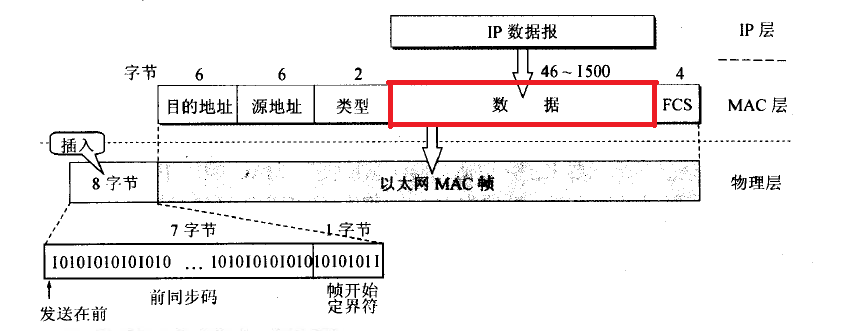

[toc]


# TCP 拥塞控制

## 一、滑动窗口


​		网络仅仅是保证了整个网络的连通性，我们基于整个网络去传输，在 TCP 协议中，不是你想发多少数据就发多少数据的，这取决于接收端的剩余容量。

​		对于每一个 socket，<u>都有一个接收缓存，和发送缓存</u>，对于接收端来讲，我们<u>必须确保</u>这个接收缓存不能溢出，为了做到如此，那么接收端在回复 ACK 时，必须通告这个接收缓存的可用空间有多大。


​		<u>TCP 头里定义了这个窗口大小的值。是由接收端回复 ACK 时填充的。于是发送端就可以根据这个接收端的窗口大小来发送数据，而不会导致接收端处理不过来。</u>好了，为了说明整个滑动窗口，我们来看看整个 tcp 协议控制的数据结构。


从上图我们可知：

* 接收端 LastByteRead 指向了 TCP 缓冲区中读到的位置，<u>NextByteExpected 指向的地方是收到的连续包的最后一个位置</u>，<u>LastByteRcved 指向的是收到的包的最后一个位置</u>，我们可以看到中间有些数据还没有到达，所以有数据空白区。
* 发送端的 LastByteAcked 指向了被接收端 Ack 过的位置（表示成功发送确认），LastByteSent 表示发出去了，但还没有收到成功确认的 Ack，LastByteWritten 指向的是上层应用正在写的地方。
  于是：
* 接收端在给发送端回ACK中会汇报自己的 
  `AdvertisedWindow = MaxRcvBuffer – LastByteRcvd – 1;`
* 而发送方会根据这个窗口来控制发送数据的大小，以保证接收方可以处理。


​		那接收端是如何控制发送端的发送呢？首先，我们来看这个 AdvertisedWindow 在发送端是如何控制的，首先看这个布局：


上图中分成了四个部分，分别是：（其中那个黑模型就是滑动窗口）

1. 已收到 ack 确认的数据。
2.  发还没收到 ack 的。
3.  在窗口中还没有发出的（接收方还有空间）。
4.  窗口以外的数据（接收方没空间）

既然说是滑动窗口，那这个窗口是如何调整的呢？且看下图：


下面我们来看一下整个控制流程:


### Zero Window

​		上图，我们可以看到一个处理缓慢的 Server（接收端）是怎么把Client（发送端）的TCP Sliding Window 给降成 0 的。此时，你一定会问，如果 Window 变成 0 了，TCP 会怎么样？是不是发送端就不发数据了？是的，发送端就不发数据了，你可以想像成 “ Window Closed ” ，那你一定还会问，如果发送端不发数据了，接收方一会儿 Window size 可用了，怎么通知发送端呢？

​		 当接收方宣布接收窗口的值为 0，发送方停止进一步发送数据，<u>**开始了 “ 保持定时器”（persist timer），以避免因随后的修改接收窗口的数据包丢失使连接的双侧进入死锁，发送方无法发出数据直至收到接收方修改窗口的指示。**</u>当“保持定时器”到期时，TCP发送方尝试恢复发送一个<u>**小的ZWP包（Zero Window Probe）**</u>，期待接收方回复一个带着新的接收窗口大小的确认包。一般 ZWP 包会设置成 3 次，如果 3 次过后还是 0 的话，有的 TCP 实现就会发 RST 把链接断了。 

​		注意：只要有等待的地方都可能出现 DDoS 攻击，Zero Window 也不例外，一些攻击者会在和HTTP 建好链发完 GET 请求后，就把 Window 设置为 0，然后服务端就只能等待进行 ZWP，于是攻击者会并发大量的这样的请求，把服务器端的资源耗尽。

​		另外，Wireshark  中，你可以使用 tcp.analysis.zero_window 来过滤包，然后使用右键菜单里的follow TCP stream，你可以看到 ZeroWindowProbe 及 ZeroWindowProbeAck 的包。


**Silly Window Syndrome**

Silly Window Syndrome翻译成中文就是“糊涂窗口综合症”。正如你上面看到的一样，如果我们的接收方太忙了，来不及取走Receive Windows里的数据，那么，就会导致发送方越来越小。到最后，如果接收方腾出几个字节并告诉发送方现在有几个字节的window，而我们的发送方会义无反顾地发送这几个字节。

要知道，我们的TCP+IP头有40个字节，为了几个字节，要达上这么大的开销，这太不经济了。

另外，你需要知道网络上有个MTU，对于以太网来说，MTU是1500字节，除去TCP+IP头的40个字节，真正的数据传输可以有1460，这就是所谓的MSS（Max Segment Size）注意，TCP的RFC定义这个MSS的默认值是536，这是因为 RFC 791里说了任何一个IP设备都得最少接收576尺寸的大小（实际上来说576是拨号的网络的MTU，而576减去IP头的20个字节就是536）。

如果你的网络包可以塞满MTU，那么你可以用满整个带宽，如果不能，那么你就会浪费带宽。（大于MTU的包有两种结局，一种是直接被丢了，另一种是会被重新分块打包发送） 你可以想像成一个MTU就相当于一个飞机的最多可以装的人，如果这飞机里满载的话，带宽最高，如果一个飞机只运一个人的话，无疑成本增加了，也而相当二。

所以，Silly Windows Syndrome这个现像就像是你本来可以坐200人的飞机里只做了一两个人。 要解决这个问题也不难，就是避免对小的window size做出响应，直到有足够大的window size再响应，这个思路可以同时实现在sender和receiver两端：

* 如果这个问题是由Receiver端引起的，那么就会使用 David D Clark’s 方案。在receiver端，如果收到的数据导致window size小于某个值，可以直接ack(0)回sender，这样就把window给关闭了，也阻止了sender再发数据过来，等到receiver端处理了一些数据后windows size 大于等于了MSS，或者，receiver buffer有一半为空，就可以把window打开让send 发送数据过来。
* 如果这个问题是由Sender端引起的，那么就会使用著名的 Nagle’s algorithm。这个算法的思路也是延时处理，他有两个主要的条件：1）要等到 Window Size>=MSS 或是 Data Size >=MSS，2）收到之前发送数据的ack回包，他才会发数据，否则就是在攒数据。

另外，Nagle算法默认是打开的，所以，对于一些需要小包场景的程序——比如像telnet或ssh这样的交互性比较强的程序，你需要关闭这个算法。你可以在Socket设置TCP_NODELAY选项来关闭这个算法（关闭Nagle算法没有全局参数，需要根据每个应用自己的特点来关闭）

```	c++
setsockopt(sock_fd, IPPROTO_TCP, TCP_NODELAY, (char \*)&value,sizeof(int));
```

另外，网上有些文章说TCP_CORK的socket option是也关闭Nagle算法，这不对。TCP_CORK其实是更新激进的Nagle算法，完全禁止小包发送，而Nagle算法没有禁止小包发送，只是禁止了大量的小包发送。最好不要两个选项都设置。


## 二、MTU

实际上我们再来看看数据链路层的结构。 

		**MTU（Maximum Transmission Unit）**,  就是上图红色框部分的大小，这一部分规定了网络层数据的大小最大为 1500 个字节，网络层必须确保不超过 1500 个字节，否则数据链路层会把这个包给舍弃掉。于此，对于 TCP 协议来讲，因为 IP 头为 20 个字节，TCP 头为 20 个字节，所以，**<u>TCP 协议能传输的数据最大为 1460（1500 - 20 - 20），这个值称为 MSS（Maxitum Segment Size）</u>**。


## 三、拥塞控制

​		我们在向对端发送数据时，并不是一股脑子任意发送，因为 TCP 建立连接后，就是建立了一根管道，这跟管道上，实际上有很多的工作设备，比如路由器和交换机等等，他们都会对接收到的 TCP 包进行缓存，以便实现排序，然后发送，但是这些设备并不是只为一个 TCP 连接中转数据包，大量的网络包也许会耗尽存储空间，从而导致 TCP 连接的吞吐量急剧下降。为了避免这种情况的发送，TCP 的设计必须是一种无私的协议，它必须去探测这种网络拥塞的问题，否则我们想想，一旦出现拥塞（判断是否丢包或者是否发生重传），如果 TCP 只能做重传，那么重传数据包会使得网络上的包更多，网络的负担更重，于是导致更大的延迟以及丢更多的包，于是会进入一个恶性循环，如果网络上的所有TCP 连接都是如此行事的话，那么马上就会形成 “ 网络风暴 ”，会拖垮整个网络，这也是一个灾难。那么 TCP 就应该能够检测出来这种状况，当拥塞出现时，要做自我牺牲，就像交通阻塞一样，每一辆车都应该把路给让出来，而不是再去抢路了。这说的就是拥塞控制。那是如何控制的呢？  

​		首先，我们得看 TCP 是如何充分利用网络的，TCP 实际上就是逐步探测这个通道的传输的最大能力，这个逐步探索就是我们要讲的慢启动算法，这个慢启动算法就是：新建立的连接不能一开始就大量发送数据包，而是应该根据网络状况，逐步地增加每次发送数据包的量。

具体的工作步骤就是：

#### 慢启动算法：

1. **<u>发送方维护一个拥塞窗口，刚开始时，这个拥塞窗口（cwnd，congestion window）设置为 1，这个 1 代表是一个 MSS 个字节。</u>**

2. 如果**<u>每收到一个 ACK</u>**，那么就**<u>指数增长</u>**这个 cwnd（2, 4, 8, 16, 32, 64）等，

3. 实际上不会这么一直指数级增长下去，TCP 会设置一个慢启动的**<u>阈值(ssthresh，slow start threshold，65535个字节) ，当cwnd >= ssthresh时，进入拥塞避免阶段。</u>**

#### 拥塞避免阶段

1. 每收到一个 ACK 时，cwnd = cwnd + 1/cwnd；

2. 每当每过一个 RTT 时，cwnd = cwnd + 1；

​        这样放缓了拥塞窗口的增长速率，避免增长过快导致网络拥塞，慢慢的增加调整到网络的最佳值。在这个过程中如果出现了拥塞，则进入拥塞状态。

#### 拥塞状态

那是如何判断出现拥塞状态呢？只要出现丢包就认为进入了拥塞状态。进入拥塞状态也分两种情况： 

1.  等到 RTO 超时（重传超时），重传数据包。TCP 认为这种情况太糟糕，反应也很强烈：

* sshthresh =  cwnd /2
* cwnd 重置为 1
* 进入慢启动过程

#### 快速重传

2. 连续收到 3 个 duplicate ACK 时，重传数据包，无须等待 RTO。此情况即为下面的快速重传。

【问题】什么情况下会出现 3 个 duplicate ACK？

​		T**<u>CP在收到一个乱序的报文段时，会立即发送一个重复的 ACK，并且此 ACK 不可被延迟。</u>**

​		**<u>如果连续收到 3 个或3个以上重复的ACK，TCP会判定此报文段丢失，需要重新传递，而无需等待RTO。这就叫做快速重传。</u>**

TCP Tahoe 的实现和 RTO 超时一样。
TCP Reno 的实现是：

* sshthresh = cwnd
* cwnd = cwnd /2
* 进入快速恢复算法——Fast Recovery

​       上面我们可以看到 RTO 超时后，sshthresh 会变成 cwnd 的一半，这意味着，如果cwnd<=sshthresh 时出现的丢包，那么 TCP 的 sshthresh 就会减了一半，然后等cwnd又很快地以指数级增涨爬到这个地方时，就会成慢慢的线性增涨。我们可以看到，TCP是怎么通过这种强烈地震荡快速而小心得找到网站流量的平衡点的。

#### 快速恢复算法

##### TCP Reno

​		这个算法定义在RFC5681。快速重传和快速恢复算法一般同时使用。快速恢复算法是认为，你还有3个Duplicated Acks说明网络也不那么糟糕，所以没有必要像RTO超时那么强烈。 注意，正如前面所说，进入Fast Recovery之前，cwnd 和 sshthresh已被更新：

* sshthresh = cwnd
* cwnd = cwnd /2

然后，真正的 Fast Recovery 算法如下：

* cwnd = sshthresh  + 3 * MSS （3的意思是确认有3个数据包被收到了）
* 重传Duplicated ACKs指定的数据包
* 如果再收到 duplicated Acks，那么cwnd = cwnd +1
* 如果收到了新的Ack，那么，cwnd = sshthresh ，代表恢复过程结束，然后就进入了拥塞避免的算法了。

​        如果我们仔细思考一下上面的这个算法，你就会知道，上面这个算法也有问题，那就是——它依赖于3个重复的Acks。注意，3个重复的Acks并不代表只丢了一个数据包，很有可能是丢了好多包。但这个算法只会重传一个，而剩下的那些包只能等到RTO超时，于是，进入了恶梦模式——超时一个窗口就减半一下，多个超时会超成TCP的传输速度呈级数下降，而且也不会触发Fast Recovery算法了。

##### TCP New Reno

于是，1995年，TCP New Reno（参见 RFC 6582 ）算法提出来：

* 当sender这边收到了3个Duplicated Acks，进入Fast Retransimit模式，开发重传重复Acks指示的那个包。如果只有这一个包丢了，那么，重传这个包后回来的Ack会把整个已经被sender传输出去的数据ack回来。如果没有的话，说明有多个包丢了。我们叫这个ACK为Partial ACK。
* 一旦Sender这边发现了Partial ACK出现，那么，sender就可以推理出来有多个包被丢了，于是乎继续重传sliding window里未被ack的第一个包。直到再也收不到了Partial Ack，才真正结束Fast Recovery这个过程。

我们可以看到，这个“Fast Recovery的变更”是一个非常激进的玩法，他同时延长了Fast Retransmit和Fast Recovery的过程。


## 四、BBR 算法

​		现如今，google研发了新的拥塞控制算法BBR，详情见：[https://www.zhihu.com/question/53559433](https://www.zhihu.com/question/53559433)

对于BBR算法的测试结果可以参考：
[https://www.zhihu.com/question/52933117](https://www.zhihu.com/question/52933117)

那我们如何修改拥塞控制算法呢？

* 首先我们要确保我们是否升级到了4.9版本，使用uname -r 或者uname -a  

```
lizhiyong@ubuntu:~$ uname -r
4.4.0-87-generic
lizhiyong@ubuntu:~$ uname -a
Linux ubuntu 4.4.0-87-generic #110-Ubuntu SMP Tue Jul 18 12:55:35 UTC 2017 x86_64 x86_64 x86_64 GNU/Linux
lizhiyong@ubuntu:~$

```

* 下载linux内核代码方法：到官网下载[https://www.kernel.org/](https://www.kernel.org/)
  或者git：[https://git.kernel.org/pub/scm/linux/kernel/git/stable/linux.git/](https://git.kernel.org/pub/scm/linux/kernel/git/stable/linux.git/)

升级内核版本的方法：[https://kernelnewbies.org/KernelBuild](https://kernelnewbies.org/KernelBuild)

修改内核使用的拥塞控制算法：

更新完系统内核之后，就可以开启TCP-BBR了。

1) 编辑/etc/sysctl.conf，并保存

#在文件最底部添加如下两行，如果之前已经有这些内容，请酌情删掉或修改
net.core.default_qdisc=fq
net.ipv4.tcp_congestion_control=bbr

2) 执行sysctl -p使修改后的配置文件生效
root@linode:~# sysctl -p
net.core.default_qdisc = fq
net.ipv4.tcp_congestion_control = bbr

3) 查看BBR是否开启

首先，执行下边的命令来确定内核已经开启BBR（如果返回的结果中含有BBR则证明内核已经开启）：

sysctl net.ipv4.tcp_available_congestion_control
然后，执行下边的命令，看到有tcp_bbr模块，则说明BBR已经启动：

lsmod | grep bbr
