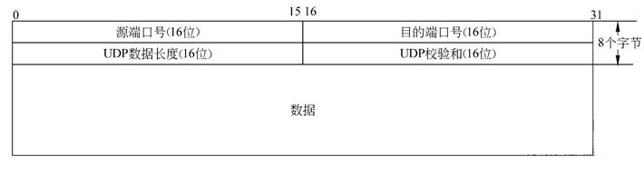

[TOC]

# 网络通信

​		<u>物理层</u>仅仅负责将比特流转换成信号并传递给线缆（光缆、电缆），既不知道信号要发送给谁，也不在意信号发送中比特信息是否会在某处丢失，因为是流式传输，所以也不知道应用层发送的一条消息的开始和结束，那么数据链路层恰好就是去解决这三个问题的.

链路层的协议内容：

* 8个字节的前导码：告诉对端链路层这是一帧数据的开始，标志了消息的开始和结束。
* 6个字节目的地址（MAC地址）：告诉这一帧是发到哪里去的。
* 6个字节的源地址（MAC地址）：告诉这一帧数据是谁发送的。
* 2字节的类型：
  * 0x0800：ipv4协议
  * 0x0806：ARP协议
  * 0x86DD：ipv6协议
* 4字节的 FCS：Frame Check Sequence，帧校验序列，其实就是CRC校验，发送数据时计算数据部分 FCS 的值填充在 FCS， 对端接收的时候也进行同样的计算，然后进行比较，如果一致则丢弃。

​		我们在发送数据时可以用 DNS 协议获取目的 IP 地址，用 ARP 协议获取目的 MAC地址：
​		主机收到后，广播（除网关外）发送 ARP 请求，如果其它端口认为匹配则回复 IP 和 MAC 地址，否则就丢弃不理会，如果都没有回复，则认为该 IP 与该网段不在同一个子网，此时就 L2 交换机向**<u>默认网关</u>**发送 ARP 请求，此时目的 MAC 地址就是默认网关的 MAC 地址。简单一句话，就是 APR 是询问 IP 地址对应的 MAC 地址。

​		但当网段不同时，广播也无法获取到对方mac地址，于是在网络层做了改进：

​		网络层加了 IP 地址信息，就是有了源 IP 地址和目的 IP 地址。
​		IP 地址是一个逻辑地址，IP 地址是由 4 个字节 32 位组成（ipv4），比如 IP 地址有 192.168.1.1，IP 地址都是由两个部分组成，一个是网络部分，一个是主机部分，他们是使用子网掩码区分的，比如子网掩码是 255.255.0.0 的话，那么**<u>网络部分</u>**就是 192.168 ，而**<u>主机部分</u>**就是 1.1 ，网络部分说明的网段，主机部分标明了主机所在网段的那一台主机。当然，IP 地址会有一些特殊的地址值存在，如：   

* 广播地址：如上面的 192.168.255.255 就是广播地址，用来发送广播数据的。
* 环回地址：比如 127.0.0.1 就是一个环回地址，实际上只要第一个字节是127 就可以，后面是啥都无所谓。如果我们是发送一个环回 IP 地址的话，我们可以用 wirshark 去抓数据看看，实际上是抓不到数据的，其实相当于在本机发送。  

​		有了 IP 地址，那我们是如何从一个网段发送到另外一个网段的呢？

​		这里就不得不提路由表和 L3 交换机的了，在 L3 交换机中保存了一个**<u>路由表</u>**，比如下文要把 1.1.1.1/24 节点的数据发送给 3.3.3.3/24 节点，那么他们的发送是通过路由表找到下一跳的位置。如图：  

​		总结一下，**<u>L2 交换机利用 MAC 地址表解决了同一网段的交换</u>**，**<u>L3 交换机利用了 ARP 缓存信息表和路由表解决了跨网段的数据交换</u>**。在通信过程了，目的IP地址一直不变化，但是源 IP 地址会不断修改为当前发送的节点（包含交换设备），MAC 地址每跨一个网段就要去变化一次。

​		L3 交换机上的路由表建立方法：

*  手动建立：就是手工去交换机上建立路由表，但是这种方式对于大型网络并不好，因为如果下一跳的地址信息发生变化或者有新增网段，我们就必须去修改本端的路由表。
*  自动建立：使用路由协议。Oh，如何使用路由协议去建立路由表就不细说了，总之跟我们上面提到的度量值是有关系的，而且有多重路由协议。

​		有了 ARP 与 多重路由协议也不能完全hot住，这里就必须谈到了一个协议，就是 NAT，地址转换协议，这个协议，其实也是节省了公网 IP 地址资源。

&emsp;&emsp;有了网络层，我们解决了主机与主机之间的通信，但是如果我们同一台主机有多个应用程序，那么返回的数据到底由那个应用程序接收呢？这是网络层解决不了的，如果网络上有丢包或者乱序，这也是网络层解决不了的，那这些问题如何解决呢？ 
&emsp;&emsp;首先在传输层定义了一个端口号，这个端口号与一个进程进行了绑定，也就是识别了进程从哪个端口发送数据出去，比如我们来看看传输层的 TCP 协议和 UDP协议的报头：  

从 OSI 的角度来看看 7 层协议

从 TCP/IP 概念角度分的 4 层协议：

